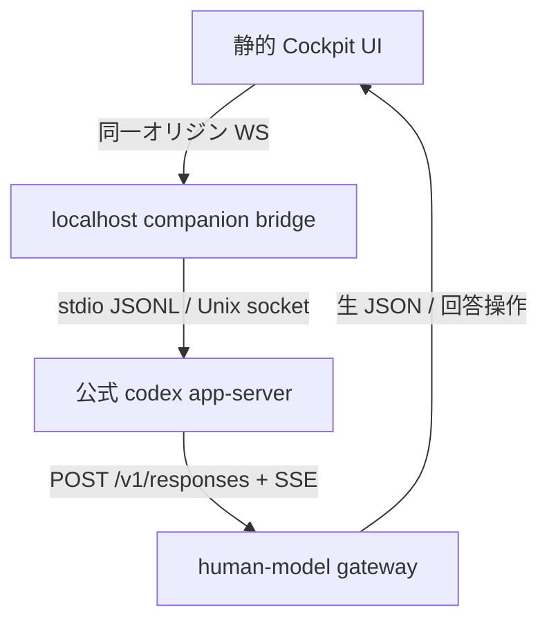

# Codex 公式ランタイム／app-server 調査

最終調査日: 2026-08-31
対象: OpenAI Codex CLI、`codex app-server`、ローカル履歴、Responses API 接続境界
再現用ソース基準: [`openai/codex@94cbbdd`](https://github.com/openai/codex/tree/94cbbddafc1776d5e377bca1b05932c697e82238)（2026-08-30）

## 結論

CodexCockpit は Codex CLI の内部を再実装せず、**公式 `codex app-server` をローカル companion process として起動する**のが最も再利用率の高い構成である。Cockpit 側で必要なのは次の二つの薄い境界だけでよい。

1. ブラウザと app-server の間をつなぐ **localhost bridge**。app-server の標準入出力 JSONL または Unix socket を終端し、ブラウザには認証済みの同一オリジン WebSocket を提供する。
2. Codex の custom model provider が接続する **Responses-compatible human-model gateway**。Codex が送る実際の JSON を右プレイヤーへ提示し、右プレイヤーの回答を Responses API の SSE に変換する。

ブラウザから app-server の WebSocket へ直接接続する案は成立しない。現行実装は `Origin` ヘッダーを含む全リクエストを `403` にし、ブラウザ WebSocket はこのヘッダーを付けるためである。また `process/*` は本物の PTY を提供するが実験的かつ Codex sandbox 外である。端末バックエンドは、sandbox 内の `command/exec` を既定、外部コンテナで隔離したセッションだけ `process/*` を許す交換可能な設計がよい。



「LLM に入る生の Jinja レンダリング結果」は、Codex とモデルサーバーの境界そのものではない。公式 Codex が送るものは Responses API の JSON リクエストであり、Jinja chat template への変換は vLLM 等の推論サーバー内部の後段処理である。Cockpit v1 で忠実に見せられるのは **Codex harness が生成した実 HTTP JSON** までである。Jinja 後の文字列も教材にするなら、将来、特定の open-weight serving engine をもう一段接続し、その engine の template-render フックを可視化する必要がある。

## 調査方法とバージョン境界

OpenAI 固有の事実は、[公式 app-server ドキュメント](https://developers.openai.com/codex/app-server)、[公式設定ドキュメント](https://developers.openai.com/codex/config-advanced)、および Apache-2.0 の [`openai/codex`](https://github.com/openai/codex) のみに基づく。`main` はリリース版より先行し得るため、以下では「ドキュメント」「固定したソーススナップショット」「インストール済みバイナリから生成する schema」を区別する。

重要な運用原則は、**バイナリのバージョンを固定し、そのバイナリで schema を生成すること**である。

```bash
codex app-server generate-ts --out ./generated/codex-app-server
codex app-server generate-json-schema --out ./generated/codex-app-server-json
```

公式ドキュメントも、生成物は実行した Codex バージョンに固有であると明記する。リポジトリ上の TypeScript 型を手で写すべきではない。

## 証拠一覧

| 論点 | 一次資料 | 確認できる事実 | Cockpit への含意 |
|---|---|---|---|
| app-server の用途 | [公式 app-server docs](https://developers.openai.com/codex/app-server) | 認証、会話履歴、approval、streamed agent events を備えた rich client 用インターフェース | CLI harness の再実装は不要 |
| wire protocol | [公式 protocol 節](https://developers.openai.com/codex/app-server#protocol) | `jsonrpc: "2.0"` を wire 上では省略する双方向 JSON-RPC。stdio は JSONL | bridge は一般的 JSON-RPC ライブラリの厳格モードをそのまま使えない場合がある |
| browser 直結不可 | [公式 transport 節](https://developers.openai.com/codex/app-server#protocol)、[`websocket.rs`](https://github.com/openai/codex/blob/94cbbddafc1776d5e377bca1b05932c697e82238/codex-rs/app-server-transport/src/transport/websocket.rs) | `Origin` を含む listener request を `403`。WS は experimental / unsupported | browser と app-server の間に bridge 必須 |
| remote TUI | [公式 remote TUI 節](https://developers.openai.com/codex/app-server#connect-the-cli-terminal-ui)、[`app-server-client/remote.rs`](https://github.com/openai/codex/blob/94cbbddafc1776d5e377bca1b05932c697e82238/codex-rs/app-server-client/src/remote.rs) | `codex --remote` は `ws:`, `wss:`, `unix:` を受ける | 同じ app-server に公式 TUI を接続する検証モードを持てる |
| terminal A | [公式 command/exec 節](https://developers.openai.com/codex/app-server#run-a-command)、[app-server README](https://github.com/openai/codex/blob/94cbbddafc1776d5e377bca1b05932c697e82238/codex-rs/app-server/README.md) | `command/exec` は sandbox 内。PTY、stdin、resize、streaming、terminate をサポート | v1 の既定 terminal backend 候補 |
| terminal B | [公式 process API 節](https://developers.openai.com/codex/app-server#process-api)、[`process.rs`](https://github.com/openai/codex/blob/94cbbddafc1776d5e377bca1b05932c697e82238/codex-rs/app-server-protocol/src/protocol/v2/process.rs) | `process/*` は experimental、host 上で Codex sandbox なし、実 PTY | 隔離 container 内だけ opt-in |
| process 実装 | [`process_exec_processor.rs`](https://github.com/openai/codex/blob/94cbbddafc1776d5e377bca1b05932c697e82238/codex-rs/app-server/src/request_processors/process_exec_processor.rs)、[`codex-utils-pty`](https://github.com/openai/codex/tree/94cbbddafc1776d5e377bca1b05932c697e82238/codex-rs/utils/pty) | `portable-pty` を使い、handle は connection-scoped。接続終了時に関連 process を kill。環境変数は host から継承後に一部を除外 | terminal 再接続はプロセス再生成前提。secret 流出対策が必要 |
| custom provider | [公式 custom provider 設定](https://developers.openai.com/codex/config-advanced#custom-model-providers)、[`model-provider-info`](https://github.com/openai/codex/blob/94cbbddafc1776d5e377bca1b05932c697e82238/codex-rs/model-provider-info/src/lib.rs) | 任意 `base_url`、認証 header、SSE retry を設定可能。wire API は `responses` のみ | human-model gateway は OpenAI Responses 互換に絞れる |
| 公式 Responses proxy | [`responses-api-proxy/README.md`](https://github.com/openai/codex/blob/94cbbddafc1776d5e377bca1b05932c697e82238/codex-rs/responses-api-proxy/README.md)、[`src/lib.rs`](https://github.com/openai/codex/blob/94cbbddafc1776d5e377bca1b05932c697e82238/codex-rs/responses-api-proxy/src/lib.rs) | loopback の `/v1/responses` だけを upstream へ転送。stdin key、hardening、request/response dump、secret header redaction を実装済み | passthrough／記録モードをゼロから作らずに済む有力候補 |
| 実リクエスト JSON | [`ResponsesApiRequest`](https://github.com/openai/codex/blob/94cbbddafc1776d5e377bca1b05932c697e82238/codex-rs/codex-api/src/common.rs)、[`responses endpoint`](https://github.com/openai/codex/blob/94cbbddafc1776d5e377bca1b05932c697e82238/codex-rs/codex-api/src/endpoint/responses.rs) | `model`, `instructions`, `input`, `tools`, `tool_choice`, reasoning 等を POST。base URL に `/responses` を追加し SSE を要求 | gateway で body をそのまま教材化できる |
| SSE 消費 | [`sse/responses.rs`](https://github.com/openai/codex/blob/94cbbddafc1776d5e377bca1b05932c697e82238/codex-rs/codex-api/src/sse/responses.rs)、[公式 test server](https://github.com/openai/codex/blob/94cbbddafc1776d5e377bca1b05932c697e82238/codex-rs/core/tests/common/streaming_sse.rs) | output item、text delta、tool input delta、completed を解釈。`response.completed` 前に stream が閉じると失敗 | right player の回答は validator を通して SSE event 列へ変換する |
| 履歴の正本 | [`thread-store/local/mod.rs`](https://github.com/openai/codex/blob/94cbbddafc1776d5e377bca1b05932c697e82238/codex-rs/thread-store/src/local/mod.rs) | canonical replay は rollout JSONL、SQLite は検索可能な metadata index | DB を Cockpit の正本にしない。app-server API から読む |
| DB ファイル | [`state/sqlite.rs`](https://github.com/openai/codex/blob/94cbbddafc1776d5e377bca1b05932c697e82238/codex-rs/state/src/sqlite.rs) | snapshot 時点で `state_5.sqlite`、`thread_history_1.sqlite` 等。名称に世代番号がある | ファイル名・schema 直結は破壊的な互換性リスク |
| history API | [公式 thread API](https://developers.openai.com/codex/app-server#threads) | list/read/resume/fork/archive/delete、turn/item pagination、検索 filter がある | SQLite を直接読む理由はほぼない |
| approvals | [公式 approvals 節](https://developers.openai.com/codex/app-server#approvals) | command/file change は server-initiated request で client が decision を返す | approval を右ペインの学習課題として可視化できる |
| auth | [公式 auth endpoints](https://developers.openai.com/codex/app-server#auth-endpoints) | API key、ChatGPT browser/device flow、account state、logout、rate limits を protocol 化 | 独自ログイン実装を避け、bridge から公式 flow を中継 |
| license | [OpenAI Codex LICENSE](https://github.com/openai/codex/blob/94cbbddafc1776d5e377bca1b05932c697e82238/LICENSE) | Apache License 2.0 | source 参照・再利用は可能。ただし NOTICE/ライセンス義務を守る |

## app-server のプロトコル境界

### Transport

| Transport | 現状 | 適所 | Cockpit 判定 |
|---|---|---|---|
| `stdio://` | 既定。1 行 1 JSON message | 親 process が app-server を spawn する desktop/companion | **第一候補**。最小の攻撃面でバージョン管理しやすい |
| `unix://` | Unix socket 上で HTTP Upgrade + WebSocket | 公式 TUI と bridge を同一 host で app-server に多重接続 | Unix の上級／検証モードに有用 |
| `ws://IP:PORT` | experimental / unsupported | localhost、SSH port forward | browser 直結不可。bridge から使う理由も stdio より弱い |
| `off` | local transport なし | remote-control 専用等 | Cockpit には不適 |

接続ごとに最初に `initialize` request、その後 `initialized` notification が必須で、それ以前の method は拒否される。`initialize.params.capabilities.experimentalApi = true` のときだけ実験 API を利用できる。Cockpit の bridge は接続状態を明示的な state machine として持ち、`initialize → initialized → ready` を UI へ反映すべきである。

WebSocket listener について、公式ページの文言と固定ソースに一つ差分がある。ページの一部には「非 loopback listener が rollout 中は未認証を許す」とある一方、固定した `websocket.rs` は認証なしの非 loopback bind を起動時に拒否する。この差分は `main` と公開ドキュメントの時間差と考えられる。どちらでも Cockpit の判断は変わらず、外部公開せず stdio/Unix socket を使う。

現行 docs に載る WS 認証は次の三系統である。

- `--ws-auth capability-token --ws-token-file /absolute/path`
- `--ws-auth capability-token --ws-token-sha256 HEX`
- `--ws-auth signed-bearer-token --ws-shared-secret-file /absolute/path`

signed bearer には issuer、audience、clock skew も設定でき、client は handshake の `Authorization: Bearer ...` に credential を載せる。認証は JSON-RPC `initialize` より前に検証される。公式推奨どおり raw token の command-line 埋め込みは避ける。Cockpit bridge が WebSocket mode を診断用に使う場合も、この認証を省略しない。

### Thread / turn / item

app-server の公開抽象は次で十分に強い。

- thread: 会話。`start`, `resume`, `read`, `list`, `fork`, `archive`, `unarchive`, `delete`。
- turn: 1 回の user request と agent work。`start`, `steer`, `interrupt`, `completed`。
- item: message、command、file change、tool call 等。`item/started`, delta, `item/completed`。

`thread/list` は cursor pagination、provider/source/cwd、archive、pin、title search 等を持つ。通常は JSONL を scan して欠けた metadata を修復し、`useStateDbOnly: true` なら SQLite index のみを使う。したがって Cockpit の replay/history panel は独自 DB index を先に作らず、この API をキャッシュするだけで開始できる。

現行の paginated history には制約が残る。公式 docs は paginated thread creation が未対応で、既存 paginated record も full-history read / turn pagination / resume が fail closed する場合を記載する。v1 では既定の legacy history を使い、paginated mode を capability probe なしで有効にしない。

## 本物の terminal を再利用する方法

### `command/exec`: v1 の安全側既定

`command/exec` は thread を作らず単発 command を app-server sandbox 内で実行する。現行 API は次を持つ。

- `tty: true` で PTY、stdin stream、stdout/stderr stream を有効化。
- `command/exec/write` で base64 stdin、`command/exec/resize` で行列数、`command/exec/terminate` で終了。
- `command/exec/outputDelta` で base64 chunk。PTY 時は terminal output が stdout に multiplex される。
- `disableTimeout: true` で対話 shell を維持できる。
- `permissionProfile` で `:read-only`, `:workspace` 等を選ぶ。低水準の `sandboxPolicy` との併用は不可。

公式 README 自身が `['bash', '-i']` の PTY 例を示しているため、xterm.js 等の表示層につなげれば bash、Node、npm、npx は「エミュレーション」ではなく host/container 上の実 process として動く。最終 response は process exit まで返らないが、output notification は逐次届くため terminal UX には問題ない。connection が閉じると process も終了するため、再接続時は新 shell と明示する。

### `process/*`: 高忠実度だが隔離必須

`process/spawn` は spawn acknowledgement をすぐ返し、client 提供の `processHandle` で stdin / resize / kill を操作し、output と exit を notification する。内部では公式 `codex-utils-pty` が `portable-pty` を使う。`tty: true` なら初期 size を指定でき、出力上限と timeout は `null` で無効化可能である。

ただし次が重大である。

- `experimentalApi` opt-in が必要。
- 「Codex sandbox なし」と protocol の型コメントに明記される。
- host process の環境変数を継承し、明示 override / unset 後に non-inheritable と分類された変数だけを除く。
- local environment が構成されていない app-server では使えない。
- handle は connection-scoped。connection close 時、実装は関連 process に kill を送る。

よって multi-user server の共有 host で絶対に直接許可しない。採用条件は **1 game session = 1 disposable container/VM = 1 app-server = 1 workspace volume** とする。API key や host credential を container environment に入れず、custom provider の認証が不要なら `env_key` 自体も設定しない。

### 推奨 terminal adapter

```ts
interface TerminalBackend {
  open(command: string[], cwd: string, rows: number, cols: number): Promise<string>;
  write(id: string, bytes: Uint8Array): Promise<void>;
  resize(id: string, rows: number, cols: number): Promise<void>;
  close(id: string): Promise<void>;
}
```

実装は `SandboxedCommandExecBackend` と `IsolatedProcessBackend` の二つに分ける。browser UI は app-server method 名を直接知らない。こうすれば experimental API の変更を bridge 内に閉じ込められる。

`thread/shellCommand` は user-initiated command を thread の turn/item stream に載せられるが、これは full access で thread sandbox policy を継承しない。教材として「この会話に属する shell action」を見せる用途には良いが、汎用 terminal backend としては権限が広すぎるので既定にしない。

## Human-model gateway: LLM 役を人間にする公式の接続点

### 先に公式 `codex-responses-api-proxy` を評価する

OpenAI Codex repository には既に [`codex-responses-api-proxy`](https://github.com/openai/codex/tree/94cbbddafc1776d5e377bca1b05932c697e82238/codex-rs/responses-api-proxy) がある。公式 npm wrapper [`@openai/codex-responses-api-proxy`](https://github.com/openai/codex/blob/94cbbddafc1776d5e377bca1b05932c697e82238/codex-rs/responses-api-proxy/npm/README.md) は macOS、Linux、Windows 用の prebuilt binary を配る構成である。

この proxy は Cockpit の要求とかなり重なる。

- `127.0.0.1` の ephemeral または指定 port だけに bind。
- `POST /v1/responses` の完全一致だけを許し、それ以外を `403`。
- upstream URL を差し替え可能。
- API key を environment ではなく stdin から読み、stack buffer の zeroize、Unix `mlock`、sensitive header を使用。
- incoming `Authorization` を捨てて privileged process の bearer token を注入。
- request / response の対を sequence + timestamp 付き JSON に dump。
- dump 時に Authorization と名前に `cookie` を含む header を redaction。
- long-lived response stream のため HTTP client timeout を無効化し、SSE body を downstream へ stream。

ただしこれは **人間が回答を作る server ではなく strict forwarding proxy** である。response dump は stream を tee しながらメモリに蓄積し、終了時にファイル化するため、right player へのリアルタイム event bus や大容量 stream の永続化としてそのまま使うべきではない。

再利用判断は次の三段階がよい。

1. one-player passthrough / trace capture では、prebuilt proxy をそのまま companion の子 process として使う。
2. manual mode では `--upstream-url` を Cockpit human gateway に向け、strict route、header behavior、dump を contract oracle にする。proxy は stdin の bearer key を常に要求するため、session-random token を渡し、human gateway 側でもそれを検証する。human gateway は受信 JSON と SSE 生成を担当する。
3. Rust companion を選ぶ場合だけ、Apache-2.0 の source を fork して event hook と streaming-safe storage を足す。独自 proxy をゼロから実装しない。

### Codex 設定

custom provider を localhost gateway へ向ける。`base_url` に `/v1` を含めると公式 client が `/responses` を追加し、`POST /v1/responses` になる。

```toml
model = "gpt-5.6-terra"
model_provider = "cockpit"

[model_providers.cockpit]
name = "CodexCockpit Human Model"
base_url = "http://127.0.0.1:4319/v1"
wire_api = "responses"
request_max_retries = 0
stream_max_retries = 0
stream_idle_timeout_ms = 1800000
```

`wire_api` は現行では Responses のみである。gateway に鍵を要求しなければ `env_key` は不要で、`account/read.requiresOpenaiAuth` も false になる設計が可能である。ゲーム中に長く考えるため idle timeout を延長する一方、切断を自動 retry すると同じ問題が二重提示され得るので retries は教材モードでは 0 が扱いやすい。

### Cockpit が受け取る JSON

固定ソースの `ResponsesApiRequest` には少なくとも次が含まれる。

- `model`
- `instructions`
- `input`（過去 message、tool output 等の Responses item）
- `tools`（JSON Schema を含む tool definitions）
- `tool_choice`, `parallel_tool_calls`
- `reasoning`
- `store`, `stream`, `include`
- 任意の `service_tier`, `prompt_cache_key`, `text`, `client_metadata`

これは「harness がモデルへ渡した内容」を学ぶには十分に生である。右ペインでは raw JSON と、教材用に分解した次の view を同時に持つとよい。

1. instructions stack
2. chronological input items
3. available tool schemas
4. current expected output grammar
5. headers / retry / stream metadata

独自にプロンプトを再構成して表示してはいけない。gateway が実際に受信した byte body を保存し、pretty view はその projection とする。

### 人間の回答から SSE へ

公式 client は `Accept: text/event-stream` を送り、最低限、次のイベント系列を理解する。

- `response.created`
- `response.output_item.added`
- `response.output_text.delta`
- `response.custom_tool_call_input.delta`
- `response.reasoning_summary_text.delta` 等
- `response.output_item.done`
- `response.completed`

特に harness が action を起こす根拠は完成した `ResponseItem` である。公式 enum は `message`, `function_call`, `custom_tool_call`, `local_shell_call`, `reasoning` ほかを持ち、function call の `arguments` は JSON object ではなく **JSON を含む文字列**、`call_id` は必須である。[`ResponseItem`](https://github.com/openai/codex/blob/94cbbddafc1776d5e377bca1b05932c697e82238/codex-rs/protocol/src/models.rs) を validator の基準にする。

ゲーム UI は raw SSE を人間に手入力させるのではなく、段階的に補助する。

- beginner: 「最終回答」「tool 選択」「arguments form」を入力し、gateway が正しい event sequence を生成。
- intermediate: output item JSON を編集し、schema validator が field と call id を補助。
- expert: SSE event 列を直接編集し、Codex parser と照合。

`response.completed` 前に stream を閉じると公式 parser は disconnected error にする。right player の submit は、必須 item と completed event を検証してから一括 commit する必要がある。公式リポジトリ内の [`StreamingSseServer`](https://github.com/openai/codex/blob/94cbbddafc1776d5e377bca1b05932c697e82238/codex-rs/core/tests/common/streaming_sse.rs) は最小互換 server と contract test のよい参照実装である。

### 一人プレイ

同じ gateway に policy を一つ追加すればよい。

- manual: 全 request を右 player が回答。
- assisted: validator / hint engine が候補を示すが submit は人間。
- passthrough: request を実 OpenAI-compatible provider へ転送し、受信 SSE を記録・再生。
- replay: 保存済み request hash と lesson fixture に一致する response を返す。

Codex 側の model provider を切り替える必要はなく、gateway の session policy のみが変わる。このため二人／一人プレイで harness の挙動が分岐しない。

## 履歴、State DB、replay

公式 source は永続性を明確に二層へ分ける。

- rollout JSONL: durable canonical replay format。SQLite がなくても旧形式を読める。
- SQLite state DB: list/read を高速化する queryable metadata index。

2026-08-30 snapshot のファイル名は `state_5.sqlite` と `thread_history_1.sqlite` だが、世代番号が示す通り変更を前提にすべきである。Cockpit が SQL table に直接依存すると、Codex の更新で壊れ、同時書き込みや migration と競合する。

推奨は次の通り。

- Codex の会話履歴: `thread/list`, `thread/read`, `thread/turns/list`, `thread/items/list` を使う。
- game 固有 state（score、hint、player presence、submitted draft）: Cockpit 自前の event log に保存。
- inference 教材 trace: human-model gateway が request bytes、validated response items、SSE emission を保存。
- shell replay: app-server item notifications と terminal I/O の双方を時刻付きで保存するが、秘密情報を redaction する。

Codex JSONL を直接変更しない。必要なら read-only export を作り、公式 thread id と game session id の対応だけ自前に持つ。

## Approval と Auth を学習要素として再利用する

app-server は command/file change の approval を server-initiated JSON-RPC request として client に送る。client は `accept`, `acceptForSession`, `decline`, `cancel` 等を返す。この往復を bridge が透過中継すれば、Cockpit は「モデルの tool call」と「harness/host の policy decision」が別物であることを正確に教えられる。

重要なのは、game の右プレイヤーが LLM 役だからといって host approval の権限まで自動で持たせないことである。少なくとも UI 上は次を分離する。

- model output author: tool call を提案する。
- host/player owner: filesystem / command / network approval を判断する。
- harness: policy、sandbox、tool execution、result injection を行う。

認証も独自実装不要で、`account/read`, `account/login/start`, `account/login/cancel`, `account/logout`, rate-limit API がある。公開 web deployment で ChatGPT token を browser storage に置かず、app-server/companion が所有する。教材専用 custom provider は OpenAI 認証不要にできるため、最初の milestone は auth なしで構築できる。

## 再利用対象の優先順位

| 優先度 | 公式資産 | 再利用方法 | 判断 |
|---|---|---|---|
| 1 | 配布済み `codex` binary / `codex app-server` | child process としてそのまま実行 | **採用**。公式 harness の同一性を最大化 |
| 1 | version-specific generated TS / JSON Schema | CI で対象 binary から生成し commit、runtime validation に使用 | **採用**。hand-written protocol type を禁止 |
| 1 | app-server thread/turn/item/auth/approval API | bridge で薄く中継 | **採用** |
| 1 | custom model provider / Responses JSON | human-model gateway の ingress contract | **採用** |
| 1 | `codex-responses-api-proxy` binary | one-player passthrough、request/response capture、secret separation | **採用候補**。manual mode は human gateway を upstream にする |
| 2 | `command/exec` PTY | terminal adapter の既定実装 | **採用候補**。実機で npm/npx と sandbox profile を検証 |
| 2 | 公式 `app-server-client` crate | bridge を Rust にする場合の in-process / remote typed client | **条件付き**。handshake、server-request 解決、ordered events を再利用できるが依存 graph は重い |
| 2 | 公式 Python SDK `openai-codex` | Python companion の thread/turn/login と generated Pydantic protocol types | **条件付き**。公開 high-level API に terminal `command/exec` / `process/*` はないため、これ単体では不足 |
| 3 | `process/*` + `codex-utils-pty` | container 隔離済みの high-fidelity terminal | **実験 opt-in** |
| 3 | `codex-api` request/SSE parser source | gateway の contract test oracle | **参照再利用**。丸ごと fork は避ける |
| 4 | `thread-store`, `state` crate / SQLite schema | 直接 link / SQL access | **不採用**。内部変更面が大きく API で足りる |
| 4 | TUI source の browser 移植 | UI を再現 | **不採用**。公式 TUI は `codex --remote` で別 terminal にそのまま動かせる |

### Protocol 作業を減らす公式 source/type

| 資産 | 既に解決していること | Cockpit での使い方 |
|---|---|---|
| `codex app-server generate-ts` / `generate-json-schema` | request、response、notification、server-initiated request の version-matched 型。既定生成では experimental method/field を filter | TypeScript bridge の唯一の型 source と runtime validator schema にする |
| [`codex-app-server-protocol`](https://github.com/openai/codex/tree/94cbbddafc1776d5e377bca1b05932c697e82238/codex-rs/app-server-protocol) | Rust enum、JSON envelope、TS/JSON Schema exporter、experimental API registry | Rust bridge なら直接 typed dispatch。JS なら binary-generated artifact のみ使用 |
| [`codex-app-server-client`](https://github.com/openai/codex/tree/94cbbddafc1776d5e377bca1b05932c697e82238/codex-rs/app-server-client) | initialize/initialized、request routing、server request resolve/reject、ordered notification、graceful shutdown。in-process と TCP/Unix remote を同じ event surface にする | companion を Rust にする場合は最有力。Node のために移植しない |
| [`openai-codex` Python SDK](https://github.com/openai/codex/tree/94cbbddafc1776d5e377bca1b05932c697e82238/sdk/python) | sync/async thread、turn、stream、steer、interrupt、auth、retry、generated protocol model | Python prototype / research harness に有用。terminal と生の全 message multiplex は別層が必要 |
| [`codex-api`](https://github.com/openai/codex/tree/94cbbddafc1776d5e377bca1b05932c697e82238/codex-rs/codex-api) と [`ResponseItem`](https://github.com/openai/codex/blob/94cbbddafc1776d5e377bca1b05932c697e82238/codex-rs/protocol/src/models.rs) | exact request struct、provider-relative `/responses`、SSE parser、tool/message item enum | human gateway の fixture/validator の一次 contract。Rust 以外へ手移植せず JSON fixture 化 |
| `codex-responses-api-proxy` | strict localhost route、key hardening、header filtering、SSE passthrough、dump | passthrough binary と manual gateway の reference implementation |

TypeScript frontend を前提にした暫定選択は、**Node companion + binary-generated TS/JSON Schema + official proxy child process** である。Rust の app-server client は完成度が高いが、app-server/core 全体への workspace dependency があり、静的 UI の薄い companion としては build cost が大きい。性能や単一 binary 配布が支配的になった時点で Rust へ寄せる。

## Second-pass cross-check: 参照アーキテクチャの修正

`08-reference-architecture.md` の方向性は妥当だが、v1 の接続契約には次の修正が必要である。

| 08 の仮定 | 公式挙動とのずれ | 修正 |
|---|---|---|
| app-server を stdio で起動し、その PTY 内の `codex --remote` を同じ server へ接続 | stdio は app-server の **single-client mode** であり、`codex --remote` が指定できるのは `ws://`, `wss://`, `unix://` 系 endpoint だけである。既存 stdio stream へ後から attach はできない | 公式 TUI を併用する session は app-server を `--listen unix://<session socket>` で起動する。companion と TUI を別 socket connection にする。stdio は browser-only / companion-only mode に限定する（[transport docs](https://developers.openai.com/codex/app-server#transport), [server source](https://github.com/openai/codex/blob/94cbbddafc1776d5e377bca1b05932c697e82238/codex-rs/app-server/src/lib.rs)） |
| 同じ app-server に接続すれば、companion と TUI は同じ thread event を共有 | subscription は **connection 単位**である。`thread/start` / `thread/resume` / `thread/fork` を呼んだ connection は subscribe されるが、`thread/read` は subscribe しない。同じ listener にいるだけでは mirror されない | v1 は TUI connection を thread/turn/approval の owner とする。companion が後で thread を可視化する場合は thread id を得て明示的に `thread/resume` し、active turn と server-request の複数 subscriber 挙動を contract test する（[thread lifecycle docs](https://developers.openai.com/codex/app-server#threads), [subscription source](https://github.com/openai/codex/blob/94cbbddafc1776d5e377bca1b05932c697e82238/codex-rs/app-server/src/thread_state.rs)） |
| `model = "cockpit-human"` で教材用 model を定義 | 任意 slug 自体は保持されるが、catalog match がなければ Codex は warning を出して fallback model metadata を構築する。tool、reasoning level、verbosity、search、context window 等が推測/default になり、公式 harness の能力前提が別物になる | `model_provider = "cockpit"` だけで endpoint を差し替え、`model` は pinned binary の `model/list` に存在する実 model slug を使う。起動時に `model/list` と `modelProvider/capabilities/read` を検査する（[catalog selection](https://github.com/openai/codex/blob/94cbbddafc1776d5e377bca1b05932c697e82238/codex-rs/models-manager/src/manager.rs), [fallback metadata](https://github.com/openai/codex/blob/94cbbddafc1776d5e377bca1b05932c697e82238/codex-rs/models-manager/src/model_info.rs)） |
| companion と right-player UI も approval を扱う | 複数 connection への thread event 配信と、承認 server request の応答者は別問題である。二重応答を許す設計は危険 | v1 の host approval は公式 TUI だけで処理する。right-player は Responses request への model output だけを返す。browser approval mirror は別 milestone にする |

### 推奨 v1 topology

1. companion が disposable session、workspace、session 専用 `CODEX_HOME` と custom provider config を作る。
2. app-server を loopback public port ではなく session-local Unix socket listener で起動する。各 client は個別に `initialize` / `initialized` を完了する。
3. companion connection が `command/exec` PTY を terminal window へ中継し、その shell で公式 `codex --remote unix://<session socket>` を起動する。`command/exec` sandbox から socket に到達できない場合だけ、隔離 container 内の `process/*` または node-pty fallback を spike する。
4. TUI connection が thread を start/resume し、入力・tool approval・host approval を所有する。v1 の companion は同じ thread に暗黙 subscribe したと仮定しない。
5. app-server の Responses request は localhost human gateway に届き、right-player が SSE を返す。gateway は model-player の request/response を記録するが、TUI の approval owner にはならない。
6. browser は app-server socket へ直結せず、terminal と gateway room の二つだけを companion 経由で扱う。

修正後の session config 例は次のとおり。`model` と endpoint の役割を混ぜない。

```toml
# pinned binary の model/list で存在を確認する。これは教材の表示名ではない。
model = "gpt-5.6-terra"
model_provider = "cockpit"

[model_providers.cockpit]
name = "CodexCockpit Human Gateway"
base_url = "http://127.0.0.1:PORT/v1"
wire_api = "responses"
requires_openai_auth = false
request_max_retries = 0
stream_max_retries = 0
stream_idle_timeout_ms = 1800000

# gateway が Bearer token を検査する場合だけ追加し、app-server child の env に設定する。
env_key = "CODEX_COCKPIT_SESSION_TOKEN"
```

`gpt-5.6-terra` はこの調査 snapshot の具体例であり、永続定数ではない。Codex version pin ごとに `model/list` の結果と capability snapshot を fixture 化する。教材名 `cockpit-human` は Cockpit 側の room / player metadata として保持し、Codex の model slug には流用しない。Windows での同等 topology は authenticated loopback WebSocket を候補にできるが、app-server の WS transport と `codex --remote` は experimental であり、Origin 拒否・auth header・複数 client を release ごとに実機検証する。

## Cockpit に推奨する接続 seam

### Companion の責務

- pinned Codex binary の存在と version を検査。
- app-server transport を mode ごとに選ぶ。companion 単独は stdio、公式 remote TUI 併用は session-local Unix socket listener を使う。
- initialize handshake、request id、server request response、reconnect state を管理。
- browser へ同一オリジンの認証済み WS を一つ提供。
- terminal adapter と app-server event を multiplex。
- Responses-compatible localhost endpoint を提供し、受信 request を browser の right-player room へ配信。
- session workspace と process を disposable container に束ねる。
- secret redaction、message size cap、rate limit、audit log を実施。

### Browser の責務

- xterm-compatible renderer と keyboard/input。
- app-server events の可視化。ただし protocol truth は companion に置く。
- raw request byte view と typed projection。
- response builder、schema validation error の表示、hint/score。
- v1 は model-response UI のみ。approval を後で mirror する場合も、公式 TUI owner と権限・見た目・request idempotency を分離。

### 禁止する shortcut

- app-server WS への browser 直結。
- static hosting だけで本物の host bash/npm を動かせるという主張。
- Codex の SQLite table を application model として使用。
- `process/*` を共有 host へ開放。
- custom provider request を独自 Chat Completions 形式へ lossily 変換。
- post-Jinja prompt と Responses request JSON を同一視。

## リスク

| リスク | 重大度 | 根拠 | 緩和策 |
|---|---:|---|---|
| app-server / WS 自体が experimental / unsupported | 高 | 公式 docs | Codex version pin、generated schema、contract test、adapter 境界 |
| `process/*` が experimental かつ unsandboxed | 極高 | 公式 docs / protocol source | disposable container、default off、session-local credential only |
| Web docs と `main` の挙動差 | 中 | non-loopback WS auth の差分 | binary を真実とし schema + smoke test を実行 |
| response event の組み立てミス | 高 | parser は completed 前切断を error 扱い | source-derived fixtures、beginner UI は structured builder のみ |
| 長時間 human response が timeout | 中 | provider idle timeout default 300000 ms | lesson 用 timeout 延長、heartbeat は parser contract を確認後導入 |
| retry による問題の二重提示 | 中 | provider に request / stream retry がある | manual mode は retry 0、idempotency key と request hash |
| terminal から環境秘密が見える | 極高 | process 実装が host env を継承 | clean env container、allowlist、output redaction |
| DB/schema 変更 | 高 | `state_5`, history mode 制約 | SQL 禁止、app-server API、version migration test |
| connection close で terminal 消滅 | 中 | process manager / command docs | explicit session lifecycle、UX 表示、必要なら tmux は container 内で別途評価 |
| Responses API の全機能を人間が再現困難 | 中 |多様な ResponseItem / SSE | lesson ごとに許可 item subset、capability matrix、passthrough fallback |

## 最初に作るべき contract tests

1. pinned `codex --version` と生成 schema の checksum が一致する。
2. stdio で initialize / initialized / thread start / turn start / completed が通る。
3. browser 相当の `Origin` 付き WS handshake が `403` になることを確認し、誤って direct mode を再導入しない。
4. `command/exec` で `bash -i`、stdin、PTY resize、terminate が通る。
5. isolated profile で `npm --version` と `npx --yes ...` が通り、workspace 外 write が拒否される。
6. experimental mode で `process/spawn` が即時 ack、output、exit、connection close kill を満たす。
7. custom provider が受信した request に `instructions`, `input`, `tools`, `stream: true` がある。
8. assistant message の最小 SSE fixture で turn が完了する。
9. function/custom tool call fixture で harness が tool を実行し、次 request の input に tool output を含める。
10. malformed item、missing `call_id`、invalid JSON-string arguments、completed 前 close が期待した error になる。
11. restart 後に `thread/list` / `thread/read` で履歴が復元され、Cockpit 自前 DB がなくても Codex 履歴が読める。
12. approval request を decline / accept し、それぞれ item final status が一致する。
13. Unix listener に companion と `codex --remote` を同時接続し、両 connection が独立して initialize できる。stdio 起動時には remote attach endpoint が存在しないことも確認する。
14. TUI が作った thread の event が companion へ暗黙配信されず、同 thread を companion が `thread/resume` した後だけ subscription が成立することを確認する。approval server request の応答 owner は別 test にする。
15. session config の model slug が `model/list` にあり、`modelProvider/capabilities/read` が想定 snapshot と一致する。未知 slug を与える negative test では fallback metadata warning を検出して起動を fail closed する。

## 未解決事項と次の調査

1. 対象とする最初の pinned Codex release は何か。`main` snapshot ではなく npm 公開版ごとに smoke test が必要。
2. `command/exec` の `permissionProfile: ":workspace"` で対話 shell、npm cache、npx download が各 OS / container でどう振る舞うか。
3. manual response 中の 30 分 idle に対して TCP proxy / browser / companion 全層が接続を維持できるか。
4. Codex が実際に期待する assistant message、function call、custom tool call の最小 SSE sequence を release ごとに fixture 化できるか。
5. one-player passthrough の upstream SSE を byte-for-byte 記録するか、normalized event として保存するか。個人情報・reasoning の保存 policy も必要。
6. browser UI と companion の session 認証方式。CSRF / DNS rebinding / malicious local page 対策を含める。
7. 公式 TUI と companion の双方を同じ thread に subscribe した場合、approval server request がどの connection に送られ、競合応答がどう拒否されるか。v1 はこの挙動へ依存しない。
8. Windows で Unix socket が使えない場合の stdio child lifecycle、`.cmd` launcher、ConPTY の実機検証。
9. OpenAI Responses JSON と vLLM 等の post-Jinja 表現をつなぐ上級 lesson を別 runtime として扱うか。
10. app-server protocol のどの experimental field を game score に使用してよいか。experimental field を lesson の必須要件にしない基準が必要。

## 推奨意思決定

この調査時点の暫定決定は次である。

- **採用**: 公式 Codex binary、version-generated schema、custom Responses provider、app-server history/auth/approval API。transport は companion 単独なら stdio、公式 remote TUI 併用なら Unix socket。
- **v1 候補**: `command/exec` PTY を xterm-compatible frontend へ接続。
- **隔離済み実験**: `process/*` を disposable container でのみ有効化。
- **作らない**: Codex harness、会話 DB index、PTY 実装、TUI、OpenAI login flow の再実装。
- **別フェーズ**: post-Jinja prompt 可視化。これは Codex app-server ではなく inference serving engine の研究トラック。

これにより、Cockpit の独自コードは「教育ゲームとしての可視化・採点・二人同期」と「安全な browser/host bridge」に集中できる。
