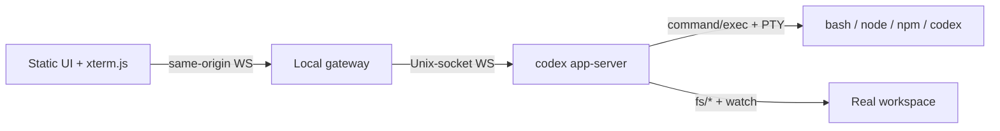

# Terminal / Shell / VFS 再利用調査

調査日: 2026-08-31
対象: CodexCockpit の左ペイン（ターミナル）、実ワークスペース、ブラウザ内簡易モード

## 結論

公式 Codex CLI を本当に動かす要件を維持するなら、主経路は「静的フロントエンド + 薄いローカル companion」にする。ブラウザだけで Bash、`npm` / `npx`、ネイティブ Rust バイナリである公式 Codex CLI を同時に再現できる、成熟した非 WASM OSS は見つからなかった。

推奨する最小スタックは次の通り。

| 層 | 採用候補 | 理由 |
|---|---|---|
| 端末表示 | [`@xterm/xterm`](https://github.com/xtermjs/xterm.js) + Fit / Search / Web Links / Unicode 系アドオン | VS Code 等で実績があり、CJK・IME・マウス・curses・アクセシビリティを自作しなくて済む |
| ブラウザ↔ローカル | 同一 origin の薄い WebSocket gateway | ブラウザへ app-server やホスト権限を直接公開せず、認証・パス制限・ゲームイベント記録を一か所に置ける |
| PTY / プロセス | 第一候補: 公式 [`codex app-server`](https://developers.openai.com/codex/app-server) の sandbox 付き `command/exec`。第二候補: 隔離 runtime 内だけで `process/*`。代替: [`node-pty`](https://github.com/microsoft/node-pty) | `command/exec` にも PTY、streaming、stdin、resize、terminate が揃う。実験的かつ unsandboxed な `process/*` を最初から選ぶ必要はない |
| ファイル | app-server v2 `fs/*` を `WorkspaceAdapter` 越しに利用 | read/write/list/watch/copy/remove が揃い、ターミナルとエディタが同じ実ディレクトリを見る |
| Git | 実行環境の公式 `git` CLI | ブラウザ Git と実 FS の二重管理を避ける |
| オフライン教材 | 既存 IndexedDB VFS を残し、必要なら `just-bash` または ZenFS を別アダプタとして追加 | 「公式 Codex 実行モード」と明確に分けた安全な疑似シェル教材としてのみ使う |

重要なのは、app-server の `command/exec` と `process/*` で安全境界が異なる点である。前者は permission profile / sandbox policy の下で動き、後者は「Codex の sandbox 外」で動く実験 API である。ローカル専用でも capability token、workspace のパス境界、プロセスのライフサイクル制限が必須。ホスト提供する場合は、どちらを使ってもセッションごとのコンテナまたは microVM を外側の境界として置き、共有ホスト上のシェルをそのまま公開してはいけない。

## 成立性: 完全静的だけでは公式 Codex CLI は動かない

[`xterm.js`](https://github.com/xtermjs/xterm.js) は端末の表示・入力部であり、README 自身が「端末アプリでも Bash でもない」と明記している。背後に PTY とプロセスが必要である。

公式 [`@openai/codex`](https://github.com/openai/codex) の npm パッケージは、対象 OS / CPU 用のネイティブ Codex 実行ファイルを選んで起動する。npm で配布されるからといってブラウザ用 JavaScript CLI ではない。そのため、次は同値ではない。

- `just-bash` / MoonBash: Bash 構文と組み込みコマンドの再実装。任意の OS プロセスや npm lifecycle script は動かない。
- Sandpack Nodebox: ブラウザ向け Node 互換ランタイム。ネイティブ Codex バイナリを実行する Linux ホストではない。
- WebContainers: `npm` / `npx` の体験は強いが、WebAssembly・cross-origin isolation・商用ライセンスに依存し、ネイティブ Codex の実行基盤にはならない。
- v86 / JSLinux: OS エミュレーションであり、ロード量・起動時間・統合コストが大きい。v86 は明示的に x86-to-WASM JIT で、非 WASM という条件にも反する。

したがって製品は二つの能力を明示的に分けるべきである。

| モード | 実体 | 表示ラベル | 主目的 |
|---|---|---|---|
| Real / Official | companion 上の実 Bash / Node / npm / npx / Codex | `Official runtime` | 本番の harness とリクエスト挙動を学ぶ |
| Tutorial / Offline | ブラウザ内の疑似 shell + VFS | `Simulated shell` | 導入、デモ、ホスト権限なしでの操作練習 |

疑似モードを公式実行と見せない。教材としては有用だが、互換性の違い自体が学習内容を誤らせるためである。

## 推奨アーキテクチャ



### ブラウザを app-server へ直結しない理由

公式ドキュメントでは app-server の TCP WebSocket transport 自体が experimental / unsupported である。また `Origin` ヘッダーを持つリクエストを `403` で拒否するため、通常のブラウザ WebSocket は直接接続できない。公式 TUI を同じ app-server へ `codex --remote unix://...` で接続する構成では、companion も Unix socket 上の WebSocket client になり、ブラウザには用途を限定した別 protocol を公開する。TUI remote 接続を使わない単純構成だけは、companion が app-server を `stdio://` の JSONL で子プロセス起動してよい。

gateway は汎用 JSON-RPC proxy にしない。ブラウザに許可する操作を次に限定する。

- terminal: `open`, `input`, `resize`, `close`
- workspace: 相対パスでの `read`, `write`, `list`, `watch`
- session: 接続、再接続、観戦者 / 操作者の role、イベント記録

app-server の `command/exec` では connection-scoped な `processId`、`tty: true`、`disableTimeout: true` を使い、`command/exec/outputDelta` を xterm へ流す。長時間 terminal では既定の出力 cap に依存せず、`disableOutputCap: true` と gateway 側の上限付き scrollback ring buffer を組み合わせる。xterm の `onData` は base64 化して `command/exec/write`、`onResize` は `command/exec/resize` へ変換する。終了は `command/exec/terminate` を使う。

公式 app-server README は、`command/exec/outputDelta` と `process/*` の通知が originating app-server connection に scoped され、その connection が閉じると server が process を終了すると明記している。ここでいう connection は browser tab ではなく companion↔app-server connection である。browser reload 後も terminal を維持したい場合、companion は app-server connection を保ち、操作者の再認証後に ring buffer と PTY を再接続する。逆に companion↔app-server connection が失われた場合は shell が終了する前提で UI を recovery 状態へ遷移する。

app-server version を固定し、ブラウザ側からは `TerminalBackend` インターフェースだけを見る。`command/exec` が長時間 shell / platform 要件を満たさなければ、隔離 container 内の `process/*`、さらに同じインターフェースの `NodePtyBackend` へ差し替えられる構造にする。

```ts
interface TerminalBackend {
  open(options: { cwd: string; cols: number; rows: number }): Promise<string>;
  write(sessionId: string, bytes: Uint8Array): Promise<void>;
  resize(sessionId: string, cols: number, rows: number): Promise<void>;
  close(sessionId: string): Promise<void>;
  onOutput(handler: (event: { sessionId: string; bytes: Uint8Array }) => void): void;
}
```

この境界は独自 PTY を再実装するためではなく、公式の実験 API を製品全体へ漏らさないための anti-corruption layer である。

## Second-pass cross-check: sandboxed shell と公式 remote TUI

統合版の [`08-reference-architecture.md`](./08-reference-architecture.md) と最新の公式 app-server README を突き合わせた結果、第一 spike は `process/*` ではなく `command/exec` に変更する。

| 観点 | `command/exec` | `process/*` |
|---|---|---|
| shell 例 | 公式 README に `bash -i` + PTY の例あり | 同じく `bash -i` の例あり |
| 対話制御 | write / resize / terminate / output delta | writeStdin / resizePty / kill / output delta / exited |
| 長時間実行 | `disableTimeout: true` が必要 | `timeoutMs: null` で無効化 |
| 出力 | 既定 1 MiB/stream。長時間 PTY は `disableOutputCap: true` + gateway ring buffer | `outputBytesCap: null` で無効化 |
| sandbox | permission profile または sandbox policy を選べる | 意図的に unsandboxed、sandbox field なし |
| maturity | `process/*` のような experimental capability opt-in は不要 | experimental API opt-in が必要 |
| response lifecycle | shell 終了まで元 request は pending | spawn acknowledgement が先、終了は notification |

`command/exec` は説明上「single command」だが、公式 README が `tty: true` の `bash -i`、streaming stdin/stdout、resize、terminate、timeout 無効化を具体的に示している。従って protocol 上は長時間 login / interactive shell の第一候補になり得る。ただし login shell の profile 読み込み、job control、signal、Windows ConPTY、長時間の backpressure は一次資料だけでは品質保証できないので、実地 spike を採用条件とする。

同じ app-server へ公式 TUI を接続する構成も概念上は成立する。

1. companion が session 固有 path で `codex app-server --listen unix://...` を起動する。
2. companion はその Unix socket に接続し、`command/exec` で sandbox 付き interactive shell を開く。
3. shell の `codex` wrapper は `codex --remote unix://...` を実行する。
4. 公式ドキュメント上 `--remote` は `unix://` と `unix://PATH` を受理するため、TUI は同じ app-server の別 connection になる。

未検証点は、選んだ permission profile が Unix socket path への接続を許すか、同一 server の複数 connection で thread / process lifecycle が期待通り分離されるか、TUI child が必要な environment と terminal control を受け取れるかである。socket は session runtime 内の明示 path に置き、sandbox profile へ最小権限だけ追加して spike する。成功を確認するまでは「公式に保証済み」ではなく「公式 transport の組み合わせとして成立性が高い」と表現する。

fallback 順序は次の通り。

1. `command/exec`: `:workspace` 相当の permission profile を基本に、教材 scenario ごとに network 等を追加。
2. `process/*`: 外側ですでに session container / microVM に隔離され、sandbox が remote socket、npm、login shell を阻害する場合だけ使用。
3. `node-pty`: app-server の process API が対象 OS / pinned version で不安定な場合。外側の隔離と独自 lifecycle manager は必須。
4. standalone `codex` TUI: remote TUI が成立しない場合、PTY 内で通常の `codex` を実行して human Responses gateway へ接続する。公式 harness は動くが、companion が監視する app-server と thread/event stream を共有できないため機能縮退として扱う。

## xterm.js: 採用するフロントエンド

2026-08-31 時点で、xterm.js は約 21k stars、MIT、直近 push は 2026-08-30。最新安定 release は 6.0.0（2025-12-22）。最新版の Chrome / Edge / Firefox / Safari を公式対象にしている。VS Code、Tabby、Hyper などで利用され、CJK・IME、emoji、mouse event、curses、screen reader mode を持つため、この領域を自作する理由はない。

推奨 addon 構成:

| addon | 判断 | 用途 / 注意 |
|---|---|---|
| Fit | 採用 | split pane のサイズに PTY の rows / cols を追従 |
| Search | 採用 | 学習ログと request trace の検索 |
| Web Links | 条件付き採用 | URL を開く前に scheme / origin を検証し、`noopener` の別 context で開く |
| Unicode Graphemes または Unicode 11 | 採用 | 日本語、絵文字、幅計算のずれを減らす。実験フラグは browser matrix で確認 |
| Serialize | 採用 | replay / reconnect 用 snapshot。正本ログにはせず、イベントログを正本にする |
| WebGL | progressive enhancement | 高速だが context loss 時は canvas / DOM に fallback。必須にしない |
| Attach | 不採用 | 独自の認証・role・resize・replay framing が必要。公式 security guide も demo / Attach をそのまま本番 WebSocket solution に使わないよう警告 |

xterm の出力、title、buffer、link、parser hook はすべて untrusted data と扱う。`innerHTML` へ渡さない。terminal title をそのまま DOM に差し込まず text node 化する。OSC 8 link も allowlist なしで自動遷移しない。

## PTY / web terminal OSS の比較

活動日は GitHub REST API の snapshot。stars は人気の補助指標であり、採用根拠そのものではない。

| 候補 | License | 活動 / release | 強み | 判断 |
|---|---|---|---|---|
| [Codex app-server `command/exec`](https://github.com/openai/codex/blob/main/codex-rs/app-server/README.md) | Apache-2.0 | Codex 本体と継続更新 | sandbox / permission profile、PTY、stdin、resize、terminate | 第一候補。長時間 shell を spike |
| Codex app-server `process/*` | Apache-2.0 | 同上 | immediate spawn ack、PTY lifecycle が明瞭 | experimental / unsandboxed。隔離 runtime 内の第二候補 |
| [microsoft/node-pty](https://github.com/microsoft/node-pty) | MIT | push 2026-08-27、v1.1.0 2025-12-22 | Linux/macOS/Windows ConPTY、VS Code / Theia / WeTTY 実績 | fallback。native build と別 protocol の保守が増える |
| [ttyd](https://github.com/tsl0922/ttyd) | MIT | push 2026-08-12、v1.7.7 2024-03-30、約 12k stars | 単一実行ファイル、CJK/IME、TLS/basic auth、UID/GID、origin check | 1日 POC / diagnostic 用。製品 UI と protocol には組み込まない |
| [WeTTY](https://github.com/butlerx/wetty) | MIT | push 2026-08-28、v3.2.0 2026-07-16、約 5.4k stars | Node stack、xterm、SSH/login、iframe option | SSH terminal 製品としては良いが、app-server gateway と役割が重複 |
| [GoTTY](https://github.com/yudai/gotty) | MIT | latest release v1.0.1 は 2017、last push 2024 | 小さな Go binary | 新規採用しない。ttyd の方が活発 |

`ttyd` と WeTTY は「端末をブラウザへ出す」完成品であり、短期検証には非常に有効である。例えば隔離コンテナ内で `ttyd -W -O -o codex` を動かせば公式 TUI の表示確認は速い。一方 CodexCockpit は、右ペインの LLM role、二人プレイの権限、request / response replay、app-server event との相関を独自 UI で扱う。そのため iframe で完成品を埋めると、二重の認証・二重の xterm・別 WebSocket protocol が残る。最終構成には採用しない。

`node-pty` の README は、子プロセスが親と同じ権限で起動するため、インターネットから使う場合は container 内で起動するよう明記している。app-server `process/*` も同じ問題を持ち、さらに意図的に sandbox 外である。`command/exec` は内側の sandbox を提供するが、hosted session の hostile `npm` / `npx` を共有ホストで受け止める唯一の境界にはしない。「公式 API を使った」ことは外側の隔離の代わりにならない。

## ブラウザ内 Shell の比較

| 候補 | 実行方式 | License / 活動 | できること | できないこと | 判断 |
|---|---|---|---|---|---|
| [just-bash](https://github.com/vercel-labs/just-bash) | TypeScript の shell / command 再実装、in-memory FS | beta、活発、npm package は Apache-2.0 表記。採用時は source release の LICENSE を再確認 | pipes、redirection、variables、glob、if、関数、grep/sed/awk/jq 等 | 実プロセス、完全 Bash、任意 npm package、公式 Codex。optional Python / JS は WASM runtime を含む | tutorial mode の有力候補。core にはしない |
| [MoonBash](https://github.com/Haoxincode/MoonBash) | MoonBit から pure JS、zero dependency / no WASM を標榜 | GitHub は Apache-2.0 検出、約4 stars、tagged release なし、last push 2026-05 | 非 WASM、pure-memory POSIX shell | 小規模で互換性・security audit・保守継続性が未実証。npm/npx/公式 Codex は不可 | spike のみ。正式採用しない |
| [WebContainers](https://webcontainers.io/) | ブラウザ内 Node runtime、WASM / SharedArrayBuffer | API client / docs は公開。runtime 自体は OSS ではなく、営利 production は商用 license | npm / pnpm / yarn、Node server、PTY-like process | 非 WASM 条件、COOP/COEP、ブラウザ差、native addon / native Codex | core から除外 |
| [Sandpack Nodebox](https://github.com/Sandpack/nodebox-runtime) | ブラウザ内 Node 互換 runtime + cloud package manager | Sustainable Use License、last source push 2023 | 小さな Node demo、Sandpack 統合 | OS shell、native binary、完全 npm。package delivery が cloud に依存 | 除外 |
| [v86](https://github.com/copy/v86) | x86 emulator + x86-to-WASM JIT | BSD-2-Clause、活発、約23k stars | 実 Linux image を boot 可能 | 大きい image、boot/CPU overhead、WASM、複雑な永続化とネットワーク | 除外 |
| [JSLinux](https://bellard.org/jslinux/) | ブラウザ PC / OS emulator | デモは公開されるが、再利用可能な現行 OSS package / license 境界が不明瞭 | Linux をブラウザで体験 | 製品組込み権利、API、保守、bundle size | 除外 |

`just-bash` は「Bash for agents」という目的が教材に近く、ファイル操作・テキスト処理・安全な custom command を多数持つ。車輪の再発明を避ける意味で、自作 parser / builtins より明らかに良い。ただし README 自身が beta としており、対話 shell の PS2 や細部の互換性に未解決差分がある。学習シナリオごとに golden test を作り、`Official runtime` と出力差があるコマンドには simulated badge を出す。

MoonBash は非 WASM という条件に合うが、2026-08-31 時点で規模と採用実績が小さすぎる。競合候補として watch し、構文 test suite、resource limit、prototype pollution / path traversal、ライセンスファイルを確認するまで vendor しない。

## VFS / ファイル同期

### Real mode: 実 FS を唯一の正本にする

app-server v2 には `fs/readFile`, `fs/writeFile`, `fs/createDirectory`, `fs/getMetadata`, `fs/readDirectory`, `fs/remove`, `fs/copy`, `fs/watch`, `fs/unwatch`, `fs/changed` がある。これにより、ターミナル、Codex、Markdown editor の全てが同じディレクトリを参照できる。

RealtimeMarkdownEditor 側の IndexedDB を実 FS と双方向同期する仕組みを作るのではなく、既存 storage を adapter 化する。

```ts
interface WorkspaceAdapter {
  readFile(path: RelativePath): Promise<Uint8Array>;
  writeFile(path: RelativePath, data: Uint8Array, expectedVersion?: string): Promise<FileVersion>;
  readDirectory(path: RelativePath): Promise<DirectoryEntry[]>;
  watch(path: RelativePath, listener: (changes: RelativePath[]) => void): Promise<Disposable>;
}
```

- `AppServerWorkspace`: Real mode。実ワークスペースが正本。
- `IndexedDbWorkspace`: offline / tutorial mode。現行データをそのまま守る。
- 必要な場合のみ `ZenFsWorkspace`: Node `fs` 互換を求める browser extension 用。

active session 中に二つの adapter を同時に正本にしない。ファイル変更は `fs/watch` で editor を invalidate し、未保存 buffer と衝突した場合だけ mtime / content hash で conflict UI を出す。自動 last-write-wins は Codex が行った編集を静かに失うため禁止する。

app-server の `fs/*` は absolute host path を扱い、`fs/remove` は `recursive` と `force` が既定で true である。ブラウザへ absolute path を渡さず、gateway で次を強制する。

1. browser protocol は正規化済み relative path のみ受理する。
2. NUL、`..`、空 component、platform prefix、UNC path を拒否する。
3. workspace root と candidate を `realpath` し、root 配下であることを確認する。
4. symlink をまたぐ write / remove は既定で拒否する。
5. remove / overwrite はゲーム操作とは別の明示権限にする。
6. audit log には OS の絶対パスではなく session-relative path を保存する。

### Browser-only mode の storage 候補

| 候補 | License / 活動 | 特性 | 判断 |
|---|---|---|---|
| 既存 IndexedDB 実装 | project-owned | 既に RealtimeMarkdownEditor に存在し移行が少ない | 当面維持。adapter だけ導入 |
| [ZenFS](https://github.com/zen-fs/core) | LGPL-3.0-or-later + web app exception、v2.6.5 2026-08-26 | Node `fs` API、IndexedDB / OPFS / File System Access / mounts | Node `fs` 互換が本当に必要な時だけ採用。NOTICE と Corresponding Source link を入れる |
| [LightningFS](https://github.com/isomorphic-git/lightning-fs) | MIT、v4.7.0 2026-07-25 | isomorphic-git 用の小さい IndexedDB FS | Git 専用候補。full FS ではない |
| [BrowserFS](https://github.com/jvilk/BrowserFS) | deprecated 2024-03 | 多数 backend の先駆け | 新規採用しない。maintainer が ZenFS への移行を明記 |
| [OPFS](https://developer.mozilla.org/en-US/docs/Web/API/File_System_API/Origin_private_file_system) | Web Platform API | origin-private、高速、in-place write、主要 browser | 大容量 cache / snapshot の基盤。shell や Node `fs` ではない |
| [browser-fs-access](https://github.com/GoogleChromeLabs/browser-fs-access) | Apache-2.0、活発 | File System Access API と file input / download fallback | import / export UI に有用。persistent VFS の代わりではない |

ZenFS は BrowserFS の実質的な後継で、core / DOM backend を分割し、OPFS・IndexedDB・ユーザー選択ディレクトリを Node `fs` 風に扱える。ただし current release は LGPL-3.0-or-later。web app 用の追加例外は bundling / minify を認めるが、無改変でも対応 source へのリンク等が必要である。法務負担を増やしてまで、現行 IndexedDB wrapper と同じ用途に導入しない。

LightningFS の README は isomorphic-git が必要とする subset だけを実装すると明記する。また isomorphic-git 側は、LightningFS が file operation を順不同で適用し、crash 時に repository corruption の可能性があるので Git operation 後に `fs.flush()` するよう警告している。汎用 workspace FS には使わない。

### Git

Real mode ではターミナルの native `git` を使用する。ブラウザに別の Git object database を作らない。

[`isomorphic-git`](https://github.com/isomorphic-git/isomorphic-git) は MIT、v1.41.9（2026-08-23）、ブラウザで動く純 JavaScript Git として成熟している。しかし browser の same-origin policy により、clone / push には多くの場合 CORS proxy が必要で、資格情報の保持と FS flush も考える必要がある。offline tutorial で `status`, `diff`, `commit` を教える場合だけ導入する。Real mode の Git との同期層にはしない。

## npm / npx の現実的な扱い

`npm` / `npx` を「基本機能」と呼ぶ場合、少なくとも package resolution、tarball、dependency tree、bin shim、lifecycle script、任意の子プロセスを含む。CDN から ESM を import するだけでは代替にならない。

| 要件 | pure browser shell | WebContainers | local companion |
|---|---:|---:|---:|
| `npm install` の一般的 package | × | ○ | ○ |
| package の native addon | × | 制限あり / × | OS が対応すれば ○ |
| arbitrary lifecycle script | × | Node 互換範囲 | ○、ただし危険 |
| `npx <cli>` | × | JS CLI は概ね ○ | ○ |
| 公式 `codex` native binary | × | × | ○ |
| 非 WASM | ○ | × | ○ |

よって `npm` / `npx` は companion の実 Node 環境で提供する。セキュリティ上、`npx` は任意 code execution と同義であり、command allowlist だけで安全にはならない。hosted mode では disposable environment、network egress policy、CPU / memory / process / disk quota、non-root UID が必要である。

## セキュリティ基準

### Local mode

- gateway と app-server は loopback または Unix socket のみに bind。
- 起動ごとに 128 bit 以上の random capability token を生成し、URL fragment または OS IPC で一度だけ渡す。query / log に残さない。
- gateway は厳密な `Origin` allowlist、WebSocket subprotocol token、frame size / rate limit を持つ。
- static assets も gateway から配信して same-origin にし、public HTTPS page から localhost WebSocket を開く構成を避ける。
- child process へ API key を無条件継承しない。環境変数は allowlist 方式。
- terminal output、paste、OSC sequence、file path は untrusted。
- session 終了時に process group を kill し、workspace は保持方針に従い明示 cleanup。

### Hosted two-player mode

- ゲーム session ごとに container / microVM、workspace volume、non-root UID を分離。
- read-only base image、no Docker socket、no host mounts、no privileged container。
- cgroup / ulimit で CPU、memory、PID、file size、open files、wall time を制限。
- default-deny egress。npm registry、OpenAI endpoint 等を scenario ごとに allowlist。
- TLS の WSS、短命 session token、operator / observer / model-player の role を gateway で認可。
- browser disconnect と session timeout で container を破棄。replay は別の append-only store に保存。

学習ゲームの「approval」は Codex agent の tool approval を教えるためのものである。左ペインの `command/exec` shell には事前選択した permission profile が適用される一方、`process/*` は sandbox 化されない。いずれも UI 上の approval と hosted runtime の OS 隔離を混同しない。

## 採否一覧

### 今すぐ採用

1. xterm.js core と Fit / Search / Unicode / Serialize。
2. `codex app-server` Unix socket transport、sandbox 付き `command/exec`、`fs/*`、`fs/watch` を包む gateway。remote TUI を使わない構成では stdio transport も可。
3. 実 FS を唯一の正本とする `WorkspaceAdapter`。
4. Real mode の native Bash / Node / npm / npx / Codex / Git。

### spike 後に採用判断

1. `NodePtyBackend`: app-server version 変更時の fallback が本当に必要か。
2. `just-bash`: offline tutorial の 20〜30 command scenario を満たすか。
3. OPFS: 大きな replay / workspace snapshot が IndexedDB より改善するか。
4. isomorphic-git: offline Git lesson が product scope に入るか。

### core から除外

- ttyd / WeTTY: POC には使用可。最終 gateway と UI の役割が重複。
- GoTTY: release / maintenance の新鮮さで ttyd に劣る。
- BrowserFS: 公式に deprecated。ZenFS が後継。
- WebContainers: native Codex 不可、WASM、production commercial license、cross-origin isolation。
- Nodebox: Sustainable Use License、cloud dependency、native Codex 不可。
- v86 / JSLinux: 重い OS emulation で要件と逆方向。
- MoonBash: 現時点では小規模すぎる。非 WASM tutorial candidate として watch のみ。

## 最小検証スパイク

実装に入る前に、次の acceptance test だけを通す縦切りを作る。これで architecture の最大リスクを1週間以内に潰せる。

1. gateway が session 固有 Unix socket で app-server を起動し、同 socket 上で initialize 完了。対照実験として stdio 構成も確認する。
2. browser の xterm から `command/exec` した Bash へ入力し、resize、Ctrl-C、exit が動く。`disableTimeout` / output cap / backpressure も確認する。
3. Bash 内で `node --version`, `npm --version`, `npx --yes cowsay ok`, `codex --version` が実行できる。
4. 同じ app-server の Unix socket へ `codex --remote unix://...` で TUI 接続し、thread / event が companion 側でも観測できる。
5. `vim` または curses app で IME / arrow / mouse / resize を確認。
6. terminal で変更した Markdown を `fs/watch` が検知し、editor が reload / conflict 表示。
7. terminal から `../`、symlink、絶対パスを狙っても gateway の workspace API は外へ出ない。
8. browser reload 後に scrollback snapshot と process state を正しく表示し、再操作権限を再認証。
9. companion↔app-server connection close と明示 terminate の双方で Bash、TUI、子プロセスが残らない。
10. Linux / macOS / Windows 11 で shell path、ConPTY、IME、改行、signal 差を記録。

`command/exec` が login shell / remote socket / 対象 OS で要件を満たさない場合、外側の隔離を確認して `process/*`、続いて `NodePtyBackend` で同じ acceptance test を再実行する。UI や game protocol を変えずに backend だけ差し替えられれば、抽象境界は十分である。

## 一次資料

- [OpenAI: Codex app-server](https://developers.openai.com/codex/app-server)
- [openai/codex: app-server README](https://github.com/openai/codex/blob/main/codex-rs/app-server/README.md)
- [openai/codex: Codex CLI source and installation](https://github.com/openai/codex)
- [xterm.js repository](https://github.com/xtermjs/xterm.js)
- [xterm.js security guide](https://xtermjs.org/docs/guides/security/)
- [microsoft/node-pty](https://github.com/microsoft/node-pty)
- [tsl0922/ttyd](https://github.com/tsl0922/ttyd)
- [butlerx/wetty](https://github.com/butlerx/wetty)
- [yudai/gotty](https://github.com/yudai/gotty)
- [vercel-labs/just-bash](https://github.com/vercel-labs/just-bash)
- [Haoxincode/MoonBash](https://github.com/Haoxincode/MoonBash)
- [WebContainer documentation](https://webcontainers.io/)
- [WebContainer commercial usage](https://webcontainers.io/enterprise)
- [Sandpack/nodebox-runtime](https://github.com/Sandpack/nodebox-runtime)
- [BrowserFS deprecation notice](https://github.com/jvilk/BrowserFS)
- [ZenFS core and licensing exception](https://github.com/zen-fs/core)
- [LightningFS](https://github.com/isomorphic-git/lightning-fs)
- [isomorphic-git](https://github.com/isomorphic-git/isomorphic-git)
- [MDN: Origin private file system](https://developer.mozilla.org/en-US/docs/Web/API/File_System_API/Origin_private_file_system)
- [GoogleChromeLabs/browser-fs-access](https://github.com/GoogleChromeLabs/browser-fs-access)
- [copy/v86](https://github.com/copy/v86)
- [Fabrice Bellard: JSLinux](https://bellard.org/jslinux/)
