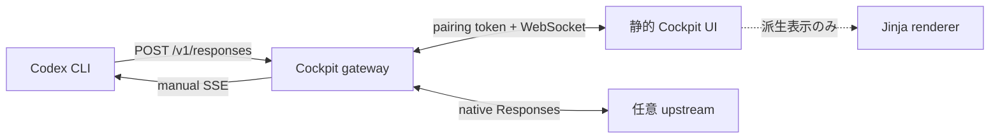
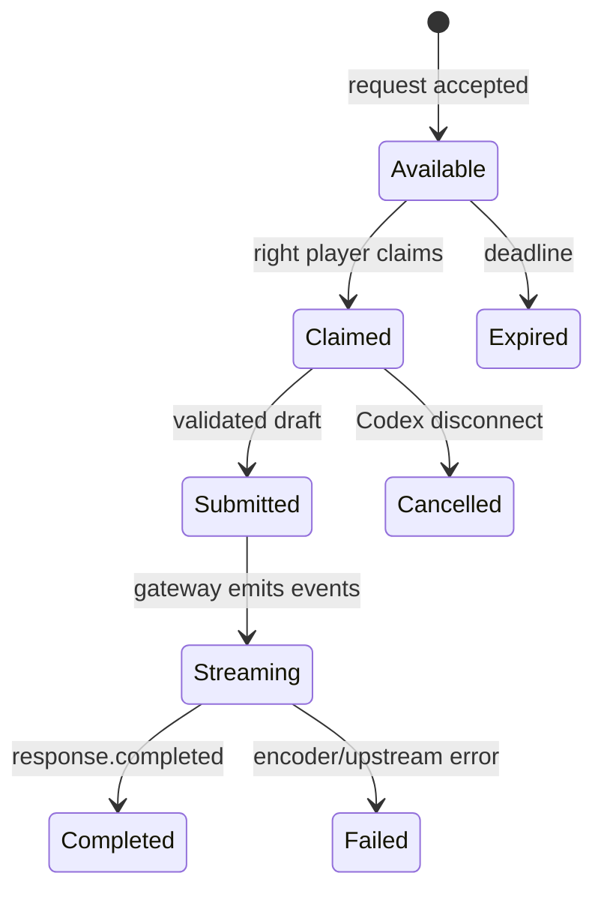
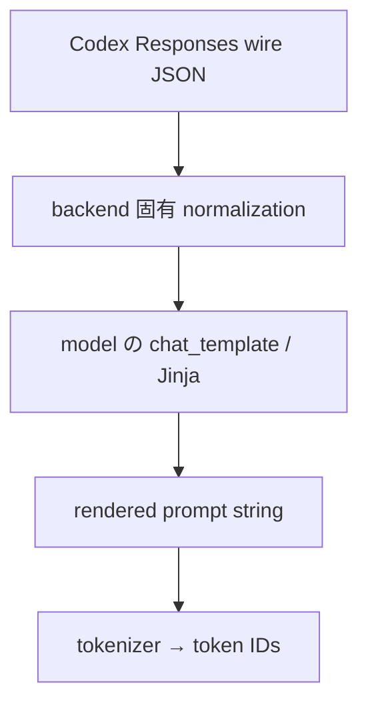

# Model gateway / Human-as-LLM 調査

調査日: 2026-08-31
対象: Codex CLI の OpenAI Responses wire を受け止め、人間が「モデル役」として応答する Codex Cockpit の右席、および 1 人プレイ用の実モデル pass-through

## 結論

中核は **Responses API に限定した薄い専用 gateway を作る**。LiteLLM や vLLM を中へ取り込むのではなく、外部 upstream として差し替え可能にする。

再利用の中心は次の 4 点である。

1. [`openai/codex` の `responses-api-proxy`](https://github.com/openai/codex/tree/main/codex-rs/responses-api-proxy) から、localhost 限定、`POST /v1/responses` 限定、秘密ヘッダーの除去、相関付き dump、API key の安全な受け渡し、プロセス hardening という **境界設計とテスト観点**を取り込む。
2. [`openai/codex` の Responses SSE parser](https://github.com/openai/codex/blob/main/codex-rs/codex-api/src/sse/responses.rs) とその fixture を、Cockpit が生成する event stream の **互換性 oracle** として使う。
3. ツール引数は request 内の JSON Schema を [Ajv](https://github.com/ajv-validator/ajv) で検証し、人間には「完成した text」または「完成した function call」を入力させる。SSE の細片化・順序・ID 生成は gateway が担う。
4. 1 人プレイは native Responses upstream への直接 pass-through を第一選択とする。多プロバイダー変換が本当に必要なときだけ LiteLLM を任意の外部 adapter として使う。ローカル推論は vLLM / Ollama / LM Studio 等を **別プロセス**で起動する。

また、Codex が送るのは Jinja 済み prompt ではない。wire 上の一次資料は `instructions`、`input`、`tools` 等を持つ JSON である。モデル固有の Jinja 文字列は推論サーバー側で初めて生成されるため、Cockpit の Jinja 表示は必ず **選択したモデルと template revision から生成した派生ビュー**として扱う。

## なぜ静的サイトだけでは完結しないか

ブラウザーだけでは、ローカルで起動した Codex CLI からの任意 HTTP request をサーバーとして待ち受けたり、CLI 側へ長時間の SSE response を返したりできない。したがって UI の配布物は静的でよいが、実行時には小さな localhost companion が必要になる。



静的 UI と gateway の通信は、Codex 用 HTTP 接続とは分ける。UI は request の claim、編集、submit、cancel 通知を WebSocket で扱い、Codex には Responses-compatible SSE だけを見せる。この分離により UI の再読み込み、2 人目の観戦、pass-through、replay を protocol 本体へ混ぜずに済む。

## Codex が実際に使う wire

### Provider 設定

Codex の公式設定は custom model provider の `base_url` と `wire_api = "responses"` を提供している。現行 docs では `responses` が唯一の wire API であり、Chat Completions 用 gateway を中核に選ぶべきではない。

```toml
model = "gpt-5.5"
model_provider = "cockpit"

[model_providers.cockpit]
name = "Codex Cockpit"
base_url = "http://127.0.0.1:8787/v1"
env_key = "CODEX_COCKPIT_TOKEN"
wire_api = "responses"
supports_websockets = false
request_max_retries = 0
stream_idle_timeout_ms = 1800000
stream_max_retries = 0
```

`CODEX_COCKPIT_TOKEN` は手動モードでは OpenAI key ではなく、localhost gateway への短命な pairing bearer にできる。pass-through の upstream key は gateway process だけが保持し、ブラウザーへ送らない。

`model` を架空の `cockpit-human` にしない点が重要である。Codex は model 名を upstream に渡すだけでなく、model catalog から instructions、tool surface、reasoning level、context、Responses Lite 等の harness capability を選ぶ。未知 slug は fallback metadata になり、`apply_patch` などが落ち得る。`gpt-5.5` は調査時点の catalog で `supported_in_api: true`、`apply_patch_tool_type: freeform`、parallel tool call 対応、`use_responses_lite: false` の既知 baseline である。ただし文字列を永続的に決め打ちせず、companion が **pin した Codex binary の catalog にこの slug が存在すること**を起動時に検証する。catalog の `prefer_websockets` とは別に custom provider の `supports_websockets = false` を明示し、教材 gateway の transport を HTTP POST + SSE に固定する。

根拠:

- [Codex advanced configuration: custom model providers](https://developers.openai.com/codex/config-advanced)
- [Codex configuration reference](https://developers.openai.com/codex/config-reference)
- [Chat Completions transport 廃止に関する Codex discussion](https://github.com/openai/codex/discussions/7782)

### Request の受理範囲

現行 Codex source の `ResponsesApiRequest` は少なくとも以下を送り得る。gateway は既知 field を検証しつつ、将来追加される未知 field を受理・inspect・pass-through できるようにする。

| Field 群 | Cockpit での意味 |
|---|---|
| `model`, `instructions`, `input` | 人間モデルに見せる主入力。`input` は message だけでなく reasoning、function call、function call output 等の item 列になり得る |
| `tools`, `tool_choice`, `parallel_tool_calls` | 右席が選べる action と制約。tool JSON Schema を editor/validator に渡す |
| `reasoning`, `include` | 期待される reasoning/summary の設定。MVP は読み取り表示し、未対応 event を黙って偽造しない |
| `text` | structured output / JSON Schema の指定を含み得る。最終 text の検証対象 |
| `stream`, `stream_options` | Codex の通常経路では streaming を想定する |
| `store`, `service_tier`, `prompt_cache_key`, `client_metadata` | inspect と pass-through 用。manual core は意味を勝手に変えない |

一次資料:

- [Codex request builder (`core/src/client.rs`)](https://github.com/openai/codex/blob/main/codex-rs/core/src/client.rs)
- [Codex `Prompt` / request normalization (`client_common.rs`)](https://github.com/openai/codex/blob/main/codex-rs/core/src/client_common.rs)
- [OpenAI Responses streaming guide](https://platform.openai.com/docs/guides/streaming-responses)
- [OpenAI Responses streaming event reference](https://platform.openai.com/docs/api-reference/responses-streaming)

`input` の内部 item は「会話表示用に潰した message 配列」へ先に変換しない。raw item の順序、ID、reasoning と function call の組を保つ。Responses の item 列には、次 turn へ正しく round-trip するため順序関係が必要な場合があり、単純な Chat Completions 変換は情報を失う。

## 最小 Responses-compatible contract

これは「OpenAI API の全機能実装」ではなく、**現行 Codex が human response を消費するための最小 contract**である。公開 API 全体への適合を名乗る場合は、別に full schema conformance が必要になる。

### Ingress

- `POST /v1/responses` のみを受理する。
- `Content-Type: application/json`、body size、JSON depth、item 数、tool 数を制限する。
- 認証済み session と 1 request を結び、内部 `request_id` を発行する。
- `stream: true` を MVP の必須条件とする。`false` は明示的な `400 unsupported_mode` か、後続 phase で同期 JSON response を実装する。
- 不明 field は破棄せず raw inspector と pass-through payload に保持する。

### Text response の最小 event 列

HTTP status は `200`、`Content-Type` は `text/event-stream`。各 event は `data: {JSON}\n\n` で送り、JSON に `type` を持たせる。

1. `response.created`
2. 任意の `response.output_item.added`
3. 0 回以上の `response.output_text.delta`
4. `response.output_item.done` — 完成した message item を含む
5. `response.completed` — 少なくとも同じ response `id` を含む

Codex parser が最終内容として確実に消費する中心は、完成 item と completion である。

```text
data: {"type":"response.output_text.delta","item_id":"msg_01","output_index":0,"content_index":0,"delta":"hello"}

data: {"type":"response.output_item.done","output_index":0,"item":{"id":"msg_01","type":"message","role":"assistant","content":[{"type":"output_text","text":"hello"}]}}

data: {"type":"response.completed","response":{"id":"resp_01"}}

```

実装では全 event に単調増加する `sequence_number` を付け、同じ `response_id` / `item_id` を event 間で維持する。上は Codex が受ける最小例であり、OpenAI 公開 schema の完全な response object を表す例ではない。

**絶対条件:** `response.completed` より前に接続を閉じない。現行 Codex parser は stream の早期 EOF をエラーにする。失敗時は、HTTP 接続をただ落とすのではなく `response.failed` または `response.incomplete` と内部原因を対応付ける。

### Tool call response

右席は request の `tools` から function を選び、`arguments` の JSON object を入力する。gateway は schema 検証後に string 化し、完成した function call item を送る。

```text
data: {"type":"response.output_item.done","output_index":0,"item":{"id":"fc_01","type":"function_call","call_id":"call_01","name":"shell","arguments":"{\"command\":\"pwd\"}"}}

data: {"type":"response.completed","response":{"id":"resp_02"}}

```

その後の役割分担は重要である。

1. Cockpit gateway は「tool を呼べ」という model output を返す。
2. Codex harness が tool の許可、実行、失敗処理を行う。
3. 次の `POST /v1/responses` の `input` に `function_call_output` が加わる。
4. 右席は次の model turn として、その結果を読んで text または次の tool call を返す。

つまり右席が tool 実行結果を偽造して同じ response に詰め込んではならない。これが「LLM と harness の境界」を体験させるゲームの核になる。

MVP は single tool call を必須とし、parallel tool calls は request 表示までに留めるか、複数 item の明示サポートを feature flag にする。`call_id`、item 順序、JSON escaping が壊れると harness が次 turn を結べない。

### Structured text

request の `text.format` に JSON Schema があれば、右席の最終 text を submit 前に Ajv で検証する。エディター上の object と wire 上の `output_text`（JSON 文字列）を分け、二重 stringify を防ぐ。Ajv は MIT で、JSON Schema draft 06/07/2019-09/2020-12 を扱う。実際に Codex が送る schema dialect を fixture で固定する。

### Usage と reasoning

- token 使用量を測っていない manual mode では `usage` を捏造しない。現行 Codex は completion の usage を省略した stream を受理できるが、出すなら必須 subfield を完全に出す。
- reasoning token/summary を表示したい場合も text から自動生成しない。MVP は request の reasoning 設定を見せるだけでよい。
- 高度モードで reasoning summary item を入力させる場合、Codex parser が扱う `response.reasoning_summary_text.delta`、`response.reasoning_summary_part.added/done`、`response.output_item.done` の順序を conformance test に追加する。

根拠: [Codex Responses SSE parser と tests](https://github.com/openai/codex/blob/main/codex-rs/codex-api/src/sse/responses.rs)

## Human gateway の内部 state machine

HTTP handler の中で無制限に人間を待つだけの設計は避け、request を明示的な状態にする。



内部 `PendingResponse` は最低限、以下を持つ。

- gateway request ID、pairing session、arrival time、deadline
- untouched wire request と redacted display copy
- status、claim owner、短命 lease、optimistic version
- validated response draft（text / function call / advanced item list の tagged union）
- emitted event ledger と terminal result
- client disconnect/cancellation token

同じ card を 2 人が submit できないよう、claim lease と compare-and-swap version を使う。Codex の transport retry を別 turn と誤認しないため、接続 attempt と logical request を分け、request fingerprint、session、時間窓で重複を検出する。ただし fingerprint だけで異なる正当な同一 prompt を統合してはならない。

待機中は `response.created` を先に送り、SSE comment (`: keepalive\n\n`) を一定間隔で送れる。comment は protocol event に数えない。Codex の `stream_idle_timeout_ms`、reverse proxy の idle timeout、人間の持ち時間の三者を揃える。期限切れは UI に理由を出し、Codex 側にも明示的な failed/incomplete を返す。

## 2 人プレイと 1 人プレイ

### 2 人 / manual

- 左席: 公式 Codex CLI を操作し、prompt、承認、tool 実行、terminal 出力を見る。
- 右席: raw request、整形 view、tool schema、過去 item、SSE preview を見て model output を組み立てる。
- gateway: ID、SSE framing、schema validation、時間制限、得点用 trace を自動化する。

右席に最初から自由な raw JSON event 編集を強制しない。通常モードは text と tool-call form、高度モードだけ event/item inspector を編集可能にする。学習対象を「何を返すか」と「wire ではどう見えるか」に分けると、ゲームとして成立しつつ protocol も学べる。

### 1 人 / solo-manual

同じ人が左右を行き来する。pause 可能な turn 制にして gateway の deadline を無効化または長くする。これは外部 API key 不要で、教材として最も再現性が高い。

### 1 人 / pass-through

gateway は upstream の native `/v1/responses` へ request を送り、SSE を Codex に転送しつつ UI の read-only inspector と trace に tee する。

- direct native Responses を標準経路にする。
- upstream event を可能な限り byte-preserving で流し、Cockpit 固有 JSON へ往復変換しない。
- OpenAI key、ローカル推論 endpoint、LiteLLM key は companion のみが保持する。
- model 名 rewrite、auth、timeout は `UpstreamAdapter` に閉じ込める。
- manual/pass-through の event ledger schema は共通にするので、同じ replay と採点 UI が使える。

### 1 人 / coach（後続）

upstream が draft を生成し、人間が accept/edit してから Codex へ送る。学習には有効だが、元の stream を一旦止めて完全 draft として扱う必要があり、純粋 pass-through とは別 mode にする。実モデルの hidden reasoning を人間へ出せるとは限らない。

## OSS / 外部資源の比較

ライセンスは linked repository の現行表示を 2026-08-31 に確認した。活動状況は非 archived、最近の commit/release/issue の有無を基準とし、星数は採否に使っていない。ライセンスは依存する tag/commit で再確認すること。

### Gateway / proxy

| 候補 | Responses 適合と活動 | License | 採否 |
|---|---|---|---|
| [`openai/codex` `responses-api-proxy`](https://github.com/openai/codex/tree/main/codex-rs/responses-api-proxy) | 公式 Codex workspace 内で現役。strict path、upstream streaming、dump、secret handling を実装。ただし domain event parser、human queue、browser channel はない | [Apache-2.0](https://github.com/openai/codex/blob/main/LICENSE) | **設計・小モジュール・tests を再利用**。whole fork はしない |
| [LiteLLM](https://github.com/BerriAI/litellm) | [`/responses` endpoint](https://docs.litellm.ai/docs/response_api) と多数 provider。native Responses と Chat Completions bridge の両方を扱い活発 | [core は MIT、`enterprise/` は別条件](https://github.com/BerriAI/litellm/blob/main/LICENSE) | optional external adapter。manual core には重すぎる |
| [Portkey Gateway](https://github.com/Portkey-AI/gateway) | routing、guardrail、cache、observability。Gateway 2.0 は pre-release 表記。Responses の tool/file mapping に [未解決例](https://github.com/Portkey-AI/gateway/issues/1583) | MIT | optional external routing。MVP 不採用 |
| [Helicone AI Gateway](https://github.com/Helicone/ai-gateway) | Responses endpoint と OTEL/routing を掲げる。別の observability platform と repository/license が異なる | **GPL-3.0** | 埋め込み/コピーしない。外部 service としてのみ検討 |
| [responses-api-compat-proxy](https://github.com/brilliantrough/responses-api-compat-proxy) | TS の小さな Responses compatibility proxy。SSE normalization/fallback の教材になるが若い | MIT | test/reference。production core の基盤にはしない |
| [Chutes responses-proxy](https://github.com/chutesai/responses-proxy) | Rust の Responses→Chat Completions 変換。fragmented tool arguments 等の良い問題設定と tests がある | **LICENSE file / Cargo license 記載なし** | アイデアの調査だけ。コードをコピー・fork・配布しない |
| [openai-api-inspect](https://github.com/zerob13/openai-api-inspect) | streaming proxy + live log viewer、Authorization redaction。WIP で小規模 | MIT | raw inspector の UX 参考。core には不採用 |
| [OpenResponses](https://github.com/Gunnarguy/OpenResponses) | raw request、async SSE、tool inspector を持つ SwiftUI client。活発だが小規模 | MIT | UX/event 表示の参考。Web コードとしては再利用しない |

#### 公式 `responses-api-proxy` を fork するか

**結論: executable 全体は fork せず、security invariant と一部 module/test を attribution 付きで移植する。**

良い部分:

- default が `127.0.0.1` bind
- endpoint を `POST /v1/responses` に限定し、それ以外を拒否
- API key を stdin から読み、memory lock、zeroization、sensitive header、process hardening を考慮
- upstream 用 Authorization を process 内で注入
- request/response dump の相関、Authorization/cookie 系 header の redaction
- response body を streaming `Read` として透過転送

そのまま使えない部分:

- blocking `tiny_http` + request ごとの thread で、人間の長時間待ち、bounded queue、backpressure、WebSocket を設計していない
- request body を全 buffer するが、Cockpit に必要な明示 body/depth/tool limits がない
- Responses item/event の型、validation、event synthesis がない
- claim/lease/cancel/retry/replay の domain state がない
- upstream URL の厳格な allowlist/SSRF 防止や browser Origin/CSRF は Cockpit 側で追加が必要

したがって Rust で companion を作るなら、async HTTP/SSE/WebSocket を持つ専用 service にし、公式 proxy の `dump.rs` / key handling / redaction とその test case を必要最小限だけ抽出する。別言語ならコードを無理に port せず、上記 invariant を acceptance tests として再実装する。Codex 内部 crate は public stable SDK ではないため、Git dependency で main branch に密結合せず、protocol fixtures を pin して追従する方が安全である。

ソース:

- [proxy README](https://github.com/openai/codex/blob/main/codex-rs/responses-api-proxy/README.md)
- [proxy server implementation](https://github.com/openai/codex/blob/main/codex-rs/responses-api-proxy/src/lib.rs)
- [dump/redaction](https://github.com/openai/codex/blob/main/codex-rs/responses-api-proxy/src/dump.rs)
- [secure API-key read](https://github.com/openai/codex/blob/main/codex-rs/responses-api-proxy/src/read_api_key.rs)

### Inference server — コードを持ち込まない候補

| 候補 | 現在の Responses 状況 | License / 活動 | 使い方 |
|---|---|---|---|
| [vLLM](https://github.com/vllm-project/vllm) | 公式 server docs が [Responses API compatibility](https://docs.vllm.ai/en/latest/serving/openai_compatible_server/) を明記し、[Responses + tool calling example](https://docs.vllm.ai/en/latest/examples/tool_calling/openai_responses_client_with_tools/) もある | Apache-2.0、非常に活発 | GPU ローカル 1-player の第一候補。外部 endpoint と contract-test target |
| [Ollama](https://github.com/ollama/ollama) | 公式 [OpenAI compatibility docs](https://docs.ollama.com/api/openai-compatibility) に `/v1/responses` の例がある。ただし「OpenAI API の一部」で完全 parity は保証されない | MIT、活発 | 導入が容易な外部 endpoint。Codex tool loop fixture 合格を条件にする |
| [llama.cpp](https://github.com/ggml-org/llama.cpp) | `llama-server` は OpenAI-compatible、Jinja/tool 対応も進むが、native Responses の現行 Codex parity は docs だけでは確証不足 | MIT、非常に活発 | compatibility adapter または事前検証後の endpoint。C++ engine を repo へ vendor しない |
| [LM Studio](https://lmstudio.ai/docs/developer/openai-compat/responses) | Responses streaming/reasoning/`previous_response_id` を明記 | application は OSS ではない。SDK は別 license | ユーザー所有の外部 desktop backend として案内可。再配布物にしない |
| [Hugging Face TGI](https://huggingface.co/docs/text-generation-inference/index) | 公式 docs が **maintenance mode** とし、主に [Messages / Chat Completions](https://huggingface.co/docs/text-generation-inference/messages_api) を説明 | Apache-2.0 だが新規基盤非推奨 | **不採用**。Responses-first の新規開発に選ばない |

これらの推論 engine、CUDA stack、model downloader、scheduler を Cockpit に含めるのは「車輪の再発明を避ける」の反対になる。Cockpit は endpoint capability probe と conformance report を提供し、推論は upstream の責任にする。モデル別 tool parser option が必要な server では、導入 recipe を adapter metadata に置く。

### Observability / tracing

| 候補 | License / footprint | 採否 |
|---|---|---|
| [OpenTelemetry GenAI semantic conventions](https://opentelemetry.io/docs/specs/semconv/registry/attributes/gen-ai/) | open standard。GenAI の一部は発展中 | 内部 trace schema をこれへ export 可能にする。content は既定で出さない |
| [Langfuse](https://github.com/langfuse/langfuse) | core は MIT、`ee/` は別条件。self-host は DB/ClickHouse/object storage/Redis 等を伴う | optional OTLP/external exporter。MVP に stack を同梱しない |
| [Helicone](https://github.com/Helicone/helicone) | observability platform repo は Apache-2.0。前述 AI Gateway repo の GPL-3.0 と混同注意。full stack は重い | optional external exporter |
| [Arize Phoenix](https://github.com/Arize-ai/phoenix) | Elastic License 2.0 | コードを埋め込まない。外部連携は利用条件確認後 |

MVP は Cockpit 自身の append-only event ledger が適切である。最低限 `request.received`、`request.claimed`、`draft.validated`、`response.event_sent`、`client.cancelled`、`tool.result_observed` を時刻付きで保存し、raw wire / redacted display / game annotation を別 field にする。後から OpenTelemetry span/event に写せる名前と相関 ID を使う。外部 tracing stack はゲーム本体の起動条件にしない。

## Jinja / chat template は wire と分離する

### 正しい層



Codex が gateway へ送る時点では左端までしか存在しない。`messages` 化、tool format、special token、generation prompt は選んだ inference backend と model に依存する。同じ wire request でも template が違えば rendered string は異なる。

したがって UI タブを次のように分ける。

1. **Wire JSON（真実）** — 受信 bytes と parsed tree。
2. **Semantic view** — instructions、items、tools を人間向けに並べた可逆 view。
3. **Rendered model view（派生）** — 選択 model、template source、revision/hash、renderer version を常に表示。
4. **Token view（さらに派生）** — 正しい tokenizer asset がある場合だけ表示。単なる文字数を token 数と呼ばない。

### 再利用候補

- [Hugging Face chat templates guide](https://huggingface.co/docs/transformers/chat_templating) と [template writing guide](https://huggingface.co/docs/transformers/chat_templating_writing) を semantics の一次資料にする。tool は JSON Schema を含む構造値として template に渡され、special token や whitespace は model 固有である。
- [`@huggingface/jinja`](https://github.com/huggingface/huggingface.js/tree/main/packages/jinja) は ML chat template 用の小さな JavaScript Jinja 実装で、modern browser / Node / Bun / Deno を対象とする。repository は [MIT](https://github.com/huggingface/huggingface.js/blob/main/LICENSE)。静的 UI の optional derived renderer に最も合う。
- [MiniJinja](https://github.com/mitsuhiko/minijinja) は Apache-2.0 の Rust 実装で活発。template を companion 側で再現する必要が出た場合の候補。ただし UI 表示のためだけに server dependency を増やす必要はない。
- [Nunjucks](https://github.com/mozilla/nunjucks) は BSD-2-Clause で browser 実行可能だが、ML chat template 専用ではない。Hugging Face 実装で不足する syntax が実証されるまで採らない。

任意の外部 template をそのまま実行すると、巨大 loop/文字列による CPU・memory 消費や、誤った helper semantics の問題が起きる。信頼済み template、入力上限、render timeout、output 上限を設ける。template asset と tokenizer config は model repository の license も別に確認し、revision を pin する。

## セキュリティ / privacy

Codex request には source、terminal 出力、環境情報、ユーザー prompt が含まれ得る。右席は「モデルと同じ可視範囲」を持つため、2 人プレイでは明示的な共有同意が必要である。

- default は loopback bind。LAN 公開は別 flag、TLS、強い認証を要求する。
- CLI と browser を短命 pairing token で同一 session に結ぶ。browser は Origin 検証、CSRF 対策、claim authorization を行う。
- `Authorization`、`Cookie`、`Set-Cookie`、proxy auth、provider-specific key を log/dump/UI から除去する。redaction は field name の case/variant も test する。
- raw request の永続化は既定 OFF。教材 replay 保存は opt-in、暗号化/削除期限/共有範囲を明示する。
- request body、tool schema、argument、SSE event、pending queue、同時 connection に上限を持つ。
- client disconnect で pending draft と upstream request を cancel する。orphan request を無期限に残さない。
- upstream URL は設定済み allowlist/scheme に限定し、request から URL を指定させない。localhost/cloud metadata への SSRF を防ぐ。
- manual mode では provider key 自体を要求しない。pass-through key は browser storage に置かない。
- dump は学習に有用だが秘密漏洩面積が大きい。公式 proxy の redaction を下限とし、content redaction preset も追加する。

## 互換性 test 計画

### Golden path

公式 Codex CLI の version を pin し、gateway を custom provider にして E2E を回す。

1. text only: 1 delta / 多 delta / empty delta / Unicode
2. single tool call → Codex が tool 実行 → 次 request の `function_call_output` → final text
3. structured output schema の valid / invalid
4. tool error、approval deny、cancel
5. manual、solo-manual、direct pass-through が同じ event ledger を生成

### Transport torture

- SSE の各 event をあらゆる byte 境界で分割する。UTF-8 multibyte、`\r\n`、複数 `data:` line、空行を含める。
- `response.completed` 前 EOF、重複 completion、逆順 sequence、異なる item ID、壊れた function arguments を failure fixture にする。
- slow human、keepalive、idle timeout、browser reload、二重 submit、claim lease expiry、CLI Ctrl-C を再現する。
- upstream retry と logical request の重複防止を確認する。retry 中の同じ tool call を二度実行させない。
- streaming 中の backpressure と client disconnect で memory/thread が増え続けないことを負荷試験する。

### Compatibility matrix

- Codex: current pinned + 1 つ前の release。定期的に `openai/codex` main の SSE fixtures と差分を見る。
- upstream: OpenAI native、vLLM、Ollama、必要なら LiteLLM。各々 text / tool loop / structured output を capability report にする。
- gateway は「OpenAI-compatible」という自己申告を信用せず、startup probe と E2E fixture の結果を UI に表示する。
- request/response fixture は公式 `responses-api-proxy --dump-dir` または Cockpit 自身で採取し、Authorization と content を scrub して commit する。

### Security regression

- header 名の大小文字、複数 Cookie、URL query、error body、dump filename から秘密が出ない。
- malicious JSON schema、deep nesting、巨大 arguments、Jinja loop、WebSocket flood に制限が効く。
- browser A が session B の request を claim/observe できない。
- pass-through allowlist を redirect や DNS rebinding で抜けられない。

## 実装順序

### Phase 0 — protocol spike

- 公式 Codex binary は改造せず custom provider で localhost へ接続。
- companion は Node.js / TypeScript + Fastify 5.x の安定系で開始する。Responses SSE は exact wire を保つ専用 encoder、browser channel は `@fastify/websocket` に分ける。
- 1 request だけ保持し、右席の textarea から text response を返す。
- Codex parser fixture を移植した SSE encoder tests を先に作る。
- raw JSON、generated events、Codex の次 request を同じ trace に表示。

完了条件: text と 1 回の tool loop が current Codex CLI で安定して通る。

### Phase 1 — playable manual core

- pairing、claim lease、cancel、deadline、bounded queue
- tool selector + Ajv validation、structured text validation
- append-only event ledger、replay、secret redaction
- solo-manual と 2-player room

### Phase 2 — 1-player automation

- native Responses pass-through adapter
- byte-preserving SSE tee、model/auth rewrite、capability probe
- vLLM / Ollama / OpenAI recipes
- LiteLLM adapter は multi-provider 需要が確認できた場合のみ

### Phase 3 — deep learning view

- `@huggingface/jinja` による pinned model template の派生表示
- event-by-event advanced composer、reasoning summary、parallel calls
- OTLP export、外部 Langfuse/Helicone integration

## 明確にやらないこと

- Chat Completions proxy を Responses gateway の中心にしない。
- vLLM、Ollama、llama.cpp、TGI の inference engine code/model runtime を repo に vendor しない。
- LiteLLM/Portkey/Helicone の routing・課金・admin stack を manual human queue の代わりにしない。
- license 不明の `chutesai/responses-proxy` からコードをコピーしない。
- Jinja rendered string を「Codex から届いた生 request」と表示しない。
- tool を gateway 内で勝手に実行しない。tool execution は Codex harness の担当として観察する。
- 測っていない token usage、reasoning、model metadata を教材用に捏造しない。

## 残る検証課題

1. 対象にする最初の Codex CLI release/tag を固定し、その tag の request struct と SSE parser を fixture 化する。
2. manual 待機中に `response.created` + comment keepalive を送る場合の Codex UI 表示、Ctrl-C、retry の実挙動を E2E で確認する。
3. Codex が出す `tools` の JSON Schema dialect と custom/freeform tool item を全採取し、Ajv で扱えない extension を列挙する。
4. parallel tool call と reasoning item を MVP に含めるか、明示的に教材 level 2 へ送るか決める。
5. Fastify の raw response 上で backpressure、disconnect、SSE comment heartbeat が期待どおり働くことを spike する。framework plugin が payload を書き換えないことを byte fixture で確認する。
6. 各 local backend の「Responses 対応」が Codex の tool loop まで含むかを、ドキュメントではなく実通信で判定する。

## 推奨依存の最小集合

| レイヤー | MVP 依存 | 理由 |
|---|---|---|
| Gateway HTTP/SSE/WS | Node.js / TypeScript、[Fastify 5.x](https://fastify.dev/) + [`@fastify/websocket`](https://github.com/fastify/fastify-websocket)、専用 SSE encoder | app-server の生成 TS 型と UI domain 型を共有し、child process/stdio を素直に扱える。巨大 AI gateway を持ち込まない |
| JSON / event validation | server 側 schema/types + golden fixtures | Codex parser と request samples を oracle にする |
| Tool/structured output form | [Ajv](https://github.com/ajv-validator/ajv) (MIT) | request の JSON Schema をそのまま submit gate に使える |
| Jinja derived view | [`@huggingface/jinja`](https://github.com/huggingface/huggingface.js/tree/main/packages/jinja) (MIT)、遅延 load | ML chat template 用で browser 対応。MVP core から分離 |
| Upstream | native Responses HTTP client | OpenAI/vLLM/Ollama 等を同じ境界で扱う |
| Trace | 内部 event ledger、optional OTLP exporter | ゲームの replay と protocol 学習を先に満たす |

この構成なら、公式 Codex を改造せずに本物の harness 挙動を使い、独自実装は「人間がモデル応答を完成させる待機・検証・可視化」に限定できる。推論、provider routing、Jinja/tokenizer、observability は既存資源を境界の外で活用できる。

## Second-pass cross-check

`01-codex-official-runtime.md` と `08-reference-architecture.md` の決定を突き合わせ、MVP の曖昧点を次のように解消する。

### 1. model slug は架空名でなく pin した catalog entry を使う

`model = "cockpit-human"` は見た目は分かりやすいが、harness 忠実度を下げる。現行 [`model_info_from_slug`](https://github.com/openai/codex/blob/main/codex-rs/models-manager/src/model_info.rs) は未知名に minimal fallback を返し、`apply_patch_tool_type: None`、限定された tool/search metadata、既定 instructions 等を選ぶ。実際に未知/取りこぼした slug で apply-patch tool が消える [Codex issue](https://github.com/openai/codex/issues/14046) もある。

この文書の config は baseline を `gpt-5.5` に修正した。現行 [`models.json`](https://github.com/openai/codex/blob/main/codex-rs/models-manager/models.json) で既知、API 対応、freeform apply-patch、parallel calls、通常 Responses の組み合わせで、minimal gateway の最初の tool loop に向く。一方 `gpt-5.6-terra` は現行 catalog で `tool_mode: code_mode_only`、`use_responses_lite: true` であり、より新しい harness 面を学ぶ **level 2 profile** にする。custom provider で 5.6 系だけ挙動が変わった [報告](https://github.com/openai/codex/issues/34881) もあるため、baseline と同じだと仮定しない。さらに既知 slug 側が WebSocket を好んでも custom provider は [`supports_websockets = false`](https://developers.openai.com/codex/config-reference) とし、MVP contract を `/v1/responses` の HTTP/SSE に固定する。

実装上の rule:

1. release manifest に Codex version、catalog/model slug、fixture hash を一緒に pin する。
2. 起動時に選択 slug の catalog metadata を読み、fallback 使用なら fail closed して UI に理由を出す。
3. lesson ごとに必要 capability（apply-patch、shell、parallel、Responses Lite 等）を宣言し、catalog と capture fixture の両方で gate する。
4. gateway は受信した `model` 値を書き換えず trace に残す。manual actor の表示名だけを「Human Model」にする。

将来 `gpt-5.5` が catalog から退役したら名前だけを自動置換せず、pinned Codex を更新し、新しい既知 slug で text/tool/structured-output fixture を通して profile version を上げる。

### 2. 公式 proxy と manual gateway の役割を分ける

公式 proxy は credential boundary と byte-preserving forward/capture には強いが、人間の claim/待機/submit を持たない。MVP の process topology を mode ごとに固定する。

| Mode | 経路 | 公式 proxy の役割 |
|---|---|---|
| 2-player / solo-manual | Codex → **TypeScript human gateway** → 合成 SSE | hot path に入れない。security invariant と fixtures の参照元 |
| 1-player live inspector | Codex → **TypeScript gateway (tee)** → **公式 proxy child** → upstream | upstream key 注入、strict forwarding、任意 dump。TS 側は UI への live tee と相関を担当 |
| Golden capture | Codex → **公式 proxy child** → upstream | prebuilt binary をそのまま recorder として使う |
| Conformance debug | Codex → 公式 proxy → human gateway | route/header/dump を比較するときだけ任意で挟む |

これなら manual mode に不要な thread/process と bearer injection を増やさず、pass-through では公式実装を再利用できる。live inspector が必要な場合も TypeScript gateway が response bytes を一度 parse→serialize せず、proxy child の stream をそのまま Codex へ pipe し、観測用 parser は横で tee を読む。観測失敗が upstream stream を壊さない設計にする。

### 3. MVP companion は TypeScript + Fastify に決定する

言語非依存 contract は維持するが、最初の実装は **Node.js / TypeScript + Fastify 5.x stable + `@fastify/websocket`** とする。

根拠:

- pinned `codex app-server generate-ts` の公式生成型をそのまま stdio bridge で使え、Rust internal crate を JS 用に再移植しないで済む。
- static UI、WebSocket message、game event ledger、response draft の tagged union を同じ TypeScript package で共有できる。
- app-server と公式 proxy の child-process lifecycle、JSONL stdio、signal/cancel の調停が Node の得意な I/O 中心 workload であり、human turn の throughput に Rust の性能優位は支配的でない。
- Fastify は TypeScript 型、route-level [`bodyLimit`](https://fastify.dev/docs/latest/Reference/Routes/)、公式 WebSocket plugin を持つ。Responses 用 SSE は plugin の高水準抽象に隠さず、`Writable` の backpressure を扱う小さな専用 encoder にする。

module 境界は `AppServerBridge`、`HumanResponsesGateway`、`UpstreamProxySupervisor`、`SessionEventLedger`、`BrowserRoom` とし、OpenAI/Codex JSON fixture を package 外の language-neutral testdata に置く。Rust へ移す判断は、単一 binary 配布、resource ceiling、Node native dependency が実測で問題になった後でよい。公式 Rust proxy source を companion 全体への workspace dependency にすることは MVP ではしない。
