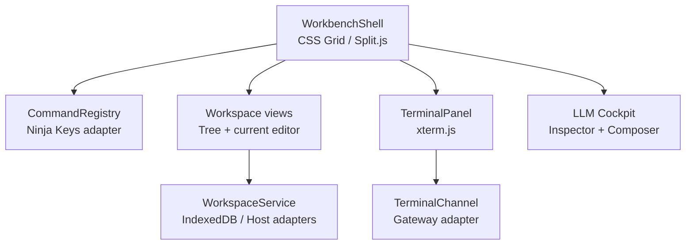

# Web IDE / Workbench 再利用調査

調査日: 2026-08-31
対象: RealtimeMarkdownEditor を母体にした CodexCockpit のブラウザ UI、ターミナル表示、ファイル操作、パネル構成

## 結論

CodexCockpit を VS Code / Theia の改造版として作るのは避ける。これらは優れた「完成 IDE」だが、ゲーム固有の二者視点、LLM リクエストの可視化、回答組み立て、採点、リプレイを主役にしにくく、既存の軽量な静的アプリを置き換える規模になる。

推奨する組み合わせは次のとおり。

1. **既存エディタは維持**する。置換が必要な場合だけ CodeMirror 6 を第一候補、VS Code に近い編集体験が必須になった場合だけ Monaco を選ぶ。
2. ターミナル表示は **xterm.js を採用**する。xterm.js はシェルではなく表示・入力コンポーネントなので、Codex/app-server 側プロセスとの接続は CodexCockpit の薄い transport adapter に分離する。
3. 初期レイアウトは **CSS Grid + Split.js**、自由なドッキング・ポップアウトを製品要件として確認できた時点で **Dockview** に昇格する。
4. コマンドパレットは自作せず、静的 HTML / Vanilla JS に組み込める **Ninja Keys** を小さく試す。すべての操作は先に `CommandRegistry` に集約し、メニュー・ショートカット・パレットから同じ command ID を呼ぶ。
5. ttyd / WeTTY は完成品を埋め込まず、PTY と WebSocket の接続、resize、切断、認証の**参照実装**として読む。CodexCockpit では app-server と別の PTY 所有者を増やさない。
6. Sandpack、WebContainers、JupyterLite は今回の実行基盤にしない。特に WebContainers と JupyterLite は WASM 前提であり、今回の「公式 Codex をホスト側で動かす」方針と競合する。

この構成なら、静的配信できる UI の価値を保ちながら、実シェルと Codex だけを companion gateway の向こう側に置ける。ブラウザ内 Linux を再実装する必要はない。

## 評価軸

「静的対応」は、ブラウザ側アセットを静的ホストから配れるかを表す。実シェル、Codex、PTY、認証、マルチプレイヤー同期にサーバが不要という意味ではない。

| 候補 | 主用途 | 埋め込み | 静的対応 | ライセンス | 統合コスト | 判定 |
|---|---|---:|---:|---|---:|---|
| [CodeMirror 6](https://codemirror.net/) | 編集エンジン | 高 | 高 | MIT | 低〜中 | **条件付き採用**。既存編集部を置換する場合の第一候補 |
| [Monaco Editor](https://github.com/microsoft/monaco-editor) | VS Code の編集エンジン | 高 | 中 | MIT | 中 | **条件付き採用**。VS Code 類似 UX が必須の場合のみ |
| [Code - OSS / VS Code web](https://github.com/microsoft/vscode) | 完成 IDE / workbench | 低 | UI のみ中 | Code - OSS は MIT、Microsoft 配布物は別ライセンス | 非常に高 | **参照のみ** |
| [code-server](https://github.com/coder/code-server) | リモート VS Code | 低 | 不可 | MIT | 高 | **別 UI 案として保留**、本体には不採用 |
| [OpenVSCode Server](https://github.com/gitpod-io/openvscode-server) | upstream に近いリモート VS Code | 低 | 不可 | MIT | 高 | **参照のみ** |
| [Eclipse Theia](https://github.com/eclipse-theia/theia) | カスタム IDE フレームワーク | 中 | 不可 | EPL-2.0 または GPL-2.0 + Classpath 例外 | 非常に高 | **今回は不採用** |
| [xterm.js](https://github.com/xtermjs/xterm.js) | ターミナル UI | 高 | 高 | MIT | 低 | **採用** |
| [ttyd](https://github.com/tsl0922/ttyd) | Web ターミナルサーバ | 低〜中 | 不可 | MIT | 中 | **参照 / 単独スパイク用** |
| [WeTTY](https://github.com/butlerx/wetty) | SSH / PTY Web ターミナル | 低〜中 | 不可 | MIT | 中 | **参照のみ** |
| [Dockview](https://github.com/dockview/dockview) | IDE 型ドッキングレイアウト | 高 | 高 | community は MIT、enterprise は商用 | 中 | **第 2 段階の候補** |
| [Split.js](https://github.com/nathancahill/split) | リサイズ可能な分割 | 高 | 高 | MIT | 低 | **初期版に採用** |
| [Lumino](https://github.com/jupyterlab/lumino) | desktop-like widget / docking | 中 | 高 | BSD-3-Clause | 中〜高 | **設計参照** |
| [Ninja Keys](https://github.com/ssleptsov/ninja-keys) | コマンドパレット Web Component | 高 | 高 | MIT | 低 | **小規模スパイク後に採用** |
| [Sandpack](https://github.com/codesandbox/sandpack) | JS ライブ編集・preview | 高 | 高 | Apache-2.0 | 中 | **不採用** |
| [WebContainer API](https://webcontainers.io/api) | ブラウザ内 Node.js | 高 | 条件付き | OSS ライブラリ扱いではなく利用条件あり | 高 | **不採用** |
| [JupyterLite](https://github.com/jupyterlite/jupyterlite) | 静的 Jupyter / browser kernel | 低 | 高 | BSD-3-Clause | 高 | **不採用、UX 参照のみ** |

### 保守性スナップショットの読み方

主要候補は 2026-08-31 時点で公開プロジェクトとして利用可能で、VS Code は月次更新、OpenVSCode Server は 2026 年にも upstream 追随リリース、Dockview / xterm.js / Theia には継続した開発履歴がある。依存はバージョン固定し、実装開始時に最新 release とセキュリティ情報を再確認する。

CodeMirror の GitHub リポジトリ群は 2026-04 に archive されたが、開発終了ではない。公式の[移行告知](https://discuss.codemirror.net/t/codemirrors-migration-to-forgejo/9706)どおり、正本が `code.haverbeke.berlin` の Forgejo に移ったためである。GitHub の archived フラグだけで候補から除外してはいけない。

| 候補群 | 2026-08-31 の activity signal | 依存時の注意 |
|---|---|---|
| CodeMirror 6 | 開発元が GitHub から Forgejo へ移行して継続 | GitHub archive ではなく新正本と npm release を監視 |
| Monaco / Code - OSS | VS Code の月次開発と連動した大規模な継続開発 | 内部 API ではなく公開 API に限定 |
| code-server | 非 archive、現行 docs と upgrade 手順あり | upstream VS Code patch と Open VSX の差分を release ごとに確認 |
| OpenVSCode Server | 非 archive、[latest release](https://github.com/gitpod-io/openvscode-server/releases/latest) は 2026 年も upstream 追随 | upstream への近さと self-host 機能の少なさを理解 |
| Eclipse Theia | release、roadmap、migration guide、SBOM を継続公開 | major/minor upgrade の extension compatibility を検証 |
| xterm.js | 非 archive、1 万件超の commit history と active addon 群 | experimental API は pin し release note を追う |
| ttyd | 非 archive、main に継続した開発履歴 | 配布済み binary と main の差、libwebsockets 互換を確認 |
| WeTTY | 非 archive、Node 20+ の現行構成 | ttyd / xterm.js より小さい maintainer base を織り込む |
| Dockview | 非 archive、v8 系 docs、verified publishing、test suite | community / enterprise package の license を lockfile 単位で確認 |
| Split.js | 非 archiveだが小さく成熟した utility | 低 churn を放棄と誤認せず、browser regression test を自前で持つ |
| Lumino / JupyterLite | Jupyter 配下で release と docs が継続 | JupyterLab compatibility matrix を確認 |
| Ninja Keys | 非 archive、static HTML example あり | 小規模 project のため version pin と代替可能な adapter を維持 |
| Sandpack | repo は非 archiveだが bundler 世代の切替に注意 | docs が指す client / bundler の組を spike 時に再確認 |
| WebContainer API | 現行 API / changelog / support policy がある | OSS release だけでなく利用規約と commercial plan を確認 |

## 編集エンジン

### CodeMirror 6

CodeMirror は Web 用エディタコンポーネントで、拡張を組み合わせる小さなパッケージ構造を持つ。Markdown / JSON / JavaScript の編集、独自 lint、decorations、transaction ベースの状態管理を必要な分だけ入れやすい。既存の静的 ES modules 構成との距離が最も短い。

CodexCockpit では、右側の「LLM レスポンス組み立て」フォームや JSON / Jinja 表示を Monaco 相当の IDE にする必要はない。CodeMirror の extension と decorations で次を表現できれば十分である。

- required field、schema error、採点ヒントの inline marker
- request JSON の read-only folding と選択範囲ハイライト
- response item のテンプレート補完
- `request_id` や tool call ID をキーにした左右ペインの連動選択

ただし RealtimeMarkdownEditor がすでに安定した編集エンジンを持つなら、移行そのものが価値を生まない。API の違うエディタへ全面移行せず、Cockpit 用の read-only inspector だけ別 instance で導入する方法もある。

### Monaco Editor

[Monaco の公式 README](https://github.com/microsoft/monaco-editor)によると、配布物は ESM を含むが、公開互換性が約束されるのは型定義で表される API で、その他の内部 API は release ごとに壊れ得る。旧 AMD build は非推奨である。Monaco の model は URI で識別されるため、VFS の path と model URI を一対一にする設計は参考になる。一方、VS Code extension は Monaco ではそのまま動かない。

Monaco を採る場合は worker の配布パス、CSP、言語 worker、bundle 分割まで所有する必要がある。単一 `index.html` への CDN 直差しではなく、Vite / Rollup 等で version pin した静的成果物を生成する。次のどれかが強い要件になるまでは CodeMirror / 既存エディタより優先しない。

- VS Code と同等に近いキーバインド・multi-cursor・diff UX
- TypeScript language service をブラウザで深く使う
- Monaco を前提にする別のライブラリとの統合

## 完成 IDE / workbench

### Code - OSS、VS Code web、code-server、OpenVSCode Server

[Code - OSS](https://github.com/microsoft/vscode) は MIT だが、Microsoft が配る Visual Studio Code 製品は別の product license と branding を持つ。この区別を依存一覧と配布物で維持する必要がある。

[VS Code for the Web の公式説明](https://code.visualstudio.com/docs/remote/vscode-web)は、ブラウザだけで repository の閲覧・軽編集はできても、terminal や runtime が必要なら remote environment を使うとしている。したがって VS Code web 単体は今回の「実 Codex terminal」の答えにならない。

[code-server](https://github.com/coder/code-server) と [OpenVSCode Server](https://github.com/gitpod-io/openvscode-server) はホスト上の workspace / terminal をブラウザに出す完成解である。特に code-server は password auth、sub-path、port proxy、Open VSX、disk 上の settings を追加している。一方、公式 FAQ は複数ユーザーを共有基盤で動かす場合に user ごとの VM を勧めており、ゲーム session の isolation は別途必要である。また Microsoft Marketplace の利用条件により、fork は原則 Open VSX を使う。

両者を CodexCockpit の一部として iframe / fork する案は採らない。

- 完成 workbench の navigation、settings、extension host がゲーム UI を圧倒する
- upstream 追随と patch 維持が主要業務になる
- game state と IDE state が二重化する
- terminal を含む remote host 権限が広く、player ごとの隔離を別に解く必要がある
- LLM request/response の細粒度イベントを中央 UI に昇格させにくい

ただし「IDE を主画面にして CodexCockpit を extension として追加する」という別製品案を将来検証する価値はある。その場合は自己ホスト向け機能が多い code-server を先に比較対象にし、OpenVSCode Server を upstream に近い対照群にする。

### Eclipse Theia

[Theia の architecture](https://theia-ide.org/docs/architecture/)は browser frontend と Node.js backend を分離し、WebSocket 上の JSON-RPC / HTTP で接続する。frontend / backend / common を分け、commands、menus、keybindings、widgets を contribution として登録する設計は非常に良い参照になる。

しかし今回は Theia application を作ると、軽量な Markdown editor の拡張ではなく新しい IDE distribution の開発になる。EPL-2.0 等の license review、DI container、plugin model、Open VSX、Node backend の運用まで引き受けるほどの利得はまだない。採用するのは「複数の言語サーバ、debugger、VS Code extensions が Cockpit の主価値」と確定した時だけでよい。

## ターミナル UI と transport

### xterm.js を採用する

[xterm.js](https://github.com/xtermjs/xterm.js) は VS Code、Tabby、Hyper 等でも使われる browser terminal component で、MIT、core は zero dependencies、CJK / IME、screen reader mode、最新主要ブラウザをサポートする。`bash`、`vim`、`tmux` のような TUI を描画できるが、公式 README が明記するように **xterm.js 自体は bash でも PTY でもない**。

初期 addon は絞る。

| addon | 初期採用 | 理由 |
|---|---:|---|
| `@xterm/addon-fit` | Yes | panel resize と PTY cols/rows を同期 |
| `@xterm/addon-search` | Yes | 学習中の transcript 検索 |
| `@xterm/addon-web-links` | 条件付き | URL scheme と遷移確認を自前 handler で制限 |
| `@xterm/addon-serialize` | Yes | 再接続時の画面復元、リプレイ補助 |
| `@xterm/addon-attach` | No | transport protocol を固定し過ぎるため、薄い adapter を書く |
| `@xterm/addon-webgl` | 後回し | 大量出力の profile 後に導入。context loss 時は DOM/canvas fallback |
| clipboard / image | 後回し | 権限・情報持ち出し・OSC 連携の threat model が必要 |

推奨インターフェースは小さい。

```ts
interface TerminalChannel {
  start(options: { cwd: string; cols: number; rows: number }): Promise<{ processId: string }>;
  write(processId: string, data: Uint8Array): void;
  resize(processId: string, cols: number, rows: number): void;
  onData(listener: (chunk: Uint8Array) => void): () => void;
  onExit(listener: (event: { code: number | null; signal?: string }) => void): () => void;
  reconnect?(processId: string, cursor?: string): Promise<void>;
}
```

transport は UTF-8 文字列だけに決め打ちせず、将来の binary frame と byte-preserving relay を許す。`ResizeObserver` の通知は debounce し、`FitAddon.proposeDimensions()` で確定した cols/rows を backend に送る。UI 再接続とプロセス寿命は分離し、タブを reload しても許可された session の process に再 attach できるようにする。

### ttyd / WeTTY から借りるもの

[ttyd](https://github.com/tsl0922/ttyd) は libwebsockets / libuv と browser terminal を組み合わせ、custom command、TLS、basic auth、reverse-proxy auth header、Unix domain socket、CJK/IME 等を備える。[WeTTY](https://github.com/butlerx/wetty) は Node.js と xterm.js を用い、WebSocket 越しに local PTY または SSH session を公開する。

借りるのは次の挙動とテストケースであり、server 本体ではない。

- PTY output → WebSocket → xterm と、keyboard input の逆方向 relay
- resize、exit code、signal、reconnect、backpressure
- IME / paste / bracketed paste / alternate screen / mouse events
- reverse proxy 配下の base path、Origin、TLS、auth forwarding
- mobile keyboard と CJK font width の実機テスト

CodexCockpit では app-server / gateway が process lifecycle と game event を知る必要がある。別プロセスの ttyd に shell 所有権を渡すと、command、approval、audit log、replay の event が分断される。最速の動作確認として `ttyd bash` を一時的に立てるのはよいが、製品 transport にはしない。

## レイアウト、file tree、command palette

### 最初は Split.js、必要になれば Dockview

[Split.js](https://github.com/nathancahill/split) は 1〜2 KB gzip、zero dependencies、CSS 主体の resize utility で、現在の二画面 Cockpit に十分である。次の固定構成から始める。

- 左: file explorer + editor / terminal tab
- 中央 gutter: keyboard でも変更できる separator
- 右: request inspector + response composer + protocol timeline
- 下: session / model / approval / connection status

[Dockview](https://github.com/dockview/dockview) は JavaScript / Vanilla TypeScript でも使え、layout serialize、tabs、groups、drag-and-drop、floating groups、popout windows、Shadow DOM を持つ。二人プレイで「LLM 側だけ別 window に popout」「event trace を補助モニターへ移す」が正式要件になったら community package を採用する価値が高い。`dockview-enterprise` は商用 license の別 package なので混同しない。

初期から Dockview を入れない理由は、自由度が game tutorial の意図した視線誘導を壊しやすいからである。tutorial 中は layout preset を固定し、上級モードだけ自由 docking を許す設計がよい。

[Lumino](https://github.com/jupyterlab/lumino) は JupyterLab で使われる widgets / layouts / events / data structures の toolkit で、desktop-like app の堅牢な参照実装である。ただし widget lifecycle と styling model を丸ごと導入するより、command registry、restorable layout、dock panel の責務分割だけを借りる。

### File tree は VFS adapter の view に徹する

file tree を IDE から切り出して移植しない。tree は workspace service の query / command だけを使い、IndexedDB と host workspace の違いを知らないようにする。

```ts
interface WorkspaceService {
  list(path: string): Promise<WorkspaceEntry[]>;
  read(path: string): Promise<Uint8Array>;
  write(path: string, data: Uint8Array, expectedRevision?: string): Promise<string>;
  rename(from: string, to: string): Promise<void>;
  remove(path: string): Promise<void>;
  watch(listener: (changes: WorkspaceChange[]) => void): () => void;
}
```

最低限借りる IDE パターンは、lazy tree、dirty marker、rename 中の focus 管理、conflict 表示、path breadcrumb、recent files、keyboard navigation である。terminal の `cwd` と editor の workspace root は同じ canonical path namespace にし、ブラウザ VFS と実 workspace の silent divergence を許さない。

### Command palette は Ninja Keys を試す

[Ninja Keys](https://github.com/ssleptsov/ninja-keys) は Vanilla JS / static HTML から ESM と Web Component として使え、nested menu、keyboard navigation、shortcut、theme、custom SVG icon を備える。React 専用の [kbar](https://github.com/timc1/kbar) を入れるために app 全体を React 化するより適合する。

ただし command の正本を Ninja Keys の配列にしない。次のような framework-neutral registry を正本とし、Ninja Keys は adapter にする。

```ts
type Command = {
  id: string;
  title: string;
  category: "Session" | "Terminal" | "Editor" | "LLM" | "Replay";
  keybinding?: string;
  when?: (state: AppState) => boolean;
  run: (context: CommandContext) => Promise<void> | void;
};
```

命名は [VS Code の command palette UX guideline](https://code.visualstudio.com/api/ux-guidelines/command-palette)を借り、明確な名前、category、必要な shortcut だけを使う。ゲーム中の command は enable/disable だけでなく、なぜ使えないかを hint として返す。

## 今回は採らない runtime / playground

### Sandpack

[Sandpack](https://github.com/codesandbox/sandpack) は CodeSandbox bundler iframe と editor / preview をつなぐ component toolkit で、React package と framework-agnostic client がある。JS tutorial や live preview には強いが、host の bash、npx、公式 Codex CLI、LLM request lifecycle を扱う runtime ではない。既存 editor / VFS とも責務が重複するため不採用。

将来、game 内に「生成された小さな React app の sandbox preview」を足す場合だけ、独立した preview panel として再評価する。

### WebContainers / StackBlitz

[WebContainer API](https://webcontainers.io/api) は browser 内 Node.js runtime、filesystem、process を提供し技術的には魅力的だが、今回の制約に合わない。

- WASM / SharedArrayBuffer と cross-origin isolation を使う
- [公式 header guide](https://webcontainers.io/guides/configuring-headers)どおり COOP / COEP が必須で、外部 asset と popup / opener の設計に影響する
- browser compatibility と runtime compatibility が host Node と同じではない
- [commercial usage](https://webcontainers.io/enterprise)は営利 production で license が必要
- 公式 Codex binary / app-server をそのまま動かす主経路にするより、host companion の方が直接的

したがって「serverless demo 用の代替 runtime」としても当面保留する。採用しないことは技術品質への評価ではなく、非 WASM・公式 Codex 優先・on-prem 学習環境という適合性の判断である。

### JupyterLite

[JupyterLite](https://github.com/jupyterlite/jupyterlite) は JupyterLab components を使い、静的 HTTP で配布でき、IndexedDB / localStorage 保存、複数 kernel / session、extension を持つ。静的 app の persistence、session recovery、command / layout の品質は参考になる。一方、Python kernel は Pyodide / Xeus 等の WASM / worker を使い、notebook が中心で、bash / Codex cockpit とは異なる。UI 全体も大きいため不採用。

## 借りるべき interaction pattern

完成 IDE のコードを移植する代わりに、検証済みの interaction を借りる。

| パターン | CodexCockpit での具体化 |
|---|---|
| command registry | menu、shortcut、command palette、tutorial action を同じ command ID に統一 |
| URI / path identity | editor model、tree node、terminal cwd、diff、audit event が同じ workspace URI を参照 |
| dirty / revision state | browser edit と host file の revision conflict を明示し、暗黙 overwrite をしない |
| restorable layout | split 比率、開いた panel、選択 request を session state に保存 |
| reconnectable terminal | UI connection と process lifetime を分離し、再 attach / snapshot restore |
| status bar | connection、player role、turn、model provider、approval、sandbox を常時表示 |
| progressive disclosure | 初心者は固定 2 ペイン、上級者は raw JSON、timeline、dock / popout |
| keyboard completeness | tree、tabs、gutter、terminal focus、response form を mouse なしで移動 |
| focus ownership | terminal の key input と global shortcut の衝突を明確な mode / Esc で解除 |

right pane は IDE の副画面ではなくゲームの主役である。raw request、rendered messages、tool call、stream item、usage、error を event timeline と相互選択できるようにし、editor chrome を過剰に複製しない。

## 推奨コンポーネント境界



Dockview に移行しても `WorkbenchShell` の内部だけを置換し、TerminalPanel、Cockpit、WorkspaceService、CommandRegistry の API は保つ。Monaco / CodeMirror を変更しても workspace と game event は影響を受けないようにする。

## 実装順と検証ゲート

### Spike A: terminal seam

- xterm.js + Fit / Search / Serialize を静的画面へ組み込む
- 最初は echo transport、次に companion gateway の 1 process へ接続
- UTF-8、CJK IME、paste、resize、alternate screen、Ctrl+C、reload/reconnect を確認
- 合格条件: terminal 表示層を変えずに fake と real transport を切り替えられる

### Spike B: workbench seam

- CSS Grid + Split.js で左 / 右を構成
- `CommandRegistry` と Ninja Keys adapter を追加
- `Open terminal`、`Focus response`、`Toggle raw request`、`Reset tutorial layout` を同じ command 経由で実行
- 合格条件: mouse なしで主要 game loop を完遂できる

### Spike C: workspace coherence

- 現 IndexedDB workspace に `WorkspaceService` adapter を被せる
- host adapter を別実装し、tree と editor は切り替えを知らない
- terminal command による file change が tree / editor へ watch event として反映される
- 合格条件: browser と shell の双方から編集して revision conflict が検出できる

### Dockview 導入ゲート

次のうち 2 つ以上が user test で必要と確認された場合だけ導入する。

- player role ごとに panel を別 browser window へ popout したい
- timeline / inspector / composer を自由に再配置したい
- 複数 terminal / request を tab group で並べたい
- 保存・共有できる layout preset が学習効果を上げる

## セキュリティと運用上の注意

- xterm.js を入れても sandbox にはならない。shell process は session ごとの container / VM / OS user 等で隔離する。
- WebSocket は session-bound capability、Origin check、短命 token、TLS を持たせる。URL query に長寿命 credential を置かない。
- terminal の link handler は `http:` / `https:` 等の allowlist と確認 UI を通す。OSC clipboard / image は threat model ができるまで無効にする。
- `ttyd -W` のような書き込み可能 terminal を public endpoint として直接公開しない。
- browser reload 後の再 attach は同一 player / session / process であることを gateway が検証する。
- terminal transcript と LLM request には API key、environment variable、prompt secret が混ざり得る。replay 保存前に redaction policy を適用する。
- CDN の `latest` import は使わず、package version と integrity を固定して build artifact に含める。静的配信は「供給元を実行時に信用し続ける」ことと同義にしない。

## 最終提案

最短かつ高品質な道は「小さな IDE を一から作る」ことでも「巨大 IDE を fork する」ことでもない。既存 RealtimeMarkdownEditor の shell を維持し、検証済み部品を細い seam で組み合わせる。

```text
既存 editor / VFS
  + xterm.js
  + CSS Grid / Split.js
  + Ninja Keys
  + framework-neutral CommandRegistry / WorkspaceService / TerminalChannel
  + companion gateway 上の実 Codex / shell
```

VS Code、Theia、JupyterLab、ttyd からは、command、URI、layout restore、PTY relay、reconnect、accessibility の設計とテストケースを借りる。完成 UI 自体は取り込まない。これが RealtimeMarkdownEditor の軽量さ、CodexCockpit の独自性、公式 Codex の実行、将来の高品質な拡張性を同時に守る判断である。

## Second-pass cross-check

### 2 プレイヤーの「2 ウィンドウ」は role-specific routes にする

文字どおり別の browser window、別端末、別ユーザーになり得るため、**Dockview popout でも BroadcastChannel 同期でもなく、同じ authoritative session に接続する二つの role-specific route** を正解とする。

```text
/sessions/{sessionId}/terminal   -> terminal-player
/sessions/{sessionId}/model      -> model-player
/sessions/{sessionId}/solo       -> 1 人用の split view
```

各 route は companion の同じ session WebSocket / append-only event stream に接続し、server が role claim、入力権限、request claim/lease、単調増加 `seq`、再接続を検証する。role や長寿命 token を URL query に入れず、招待・認証後に server が短命 capability を渡す。左 window は terminal/workspace event の書き込み権、右 window は inference response の claim/commit 権を持ち、互いの必要な event は read model として購読する。

| 選択肢 | 判定 | 理由 |
|---|---|---|
| role-specific routes + authoritative session | **採用** | 別 browser profile、別端末、remote 2 人プレイ、再接続、権限分離を同じ設計で扱える |
| Dockview popout | **player 分離には不採用** | 同じ app instance の panel/layout を別 window に動かす機能で、role authority や network session の代わりではない |
| [BroadcastChannel](https://developer.mozilla.org/en-US/docs/Web/API/Broadcast_Channel_API) | **補助用途のみ** | 同じ origin / storage partition の browsing context に限定され、cross-device で動かず、message semantics や正本性も提供しない |

同じ PC で二窓を開く場合だけ BroadcastChannel を、`focus-existing-window`、重複 window 警告、local theme 反映などの損失してもよい hint に使ってよい。terminal input、model response、presence、claim、game progress は必ず server event を正本にする。`window.open()` は model route を開く convenience に使えるが、Dockview state を player 間 protocol にしない。

これは前段の「LLM 側を別 window に popout したくなれば Dockview 導入」という判断を訂正する。**player ごとの別 window は Dockview 導入条件に数えない**。Dockview は一人の上級ユーザーが同一 role 内の timeline、inspector、複数 terminal を自由配置したい場合にだけ再評価する。

### 初期版に Ninja Keys は入れない

初期 command が `Open terminal`、`Focus response`、`Toggle raw request`、`Reset layout` 程度なら、Ninja Keys の fuzzy search、nested commands、theme/icon system は過剰である。正本は前述の `CommandRegistry` のままにし、最初の palette adapter は browser native の [`<dialog>`](https://developer.mozilla.org/en-US/docs/Web/HTML/Reference/Elements/dialog)、検索用 `<input autofocus>`、通常の `<button>` 一覧で作る。`showModal()` は focus containment、background の inert 化、Esc close を browser が提供するため、独自 modal を再発明する必要もない。初期版は substring filter と Tab navigation に限定し、fuzzy matcher や独自 roving focus を作らない。

Ninja Keys は、20〜30 個以上の command、nested category、alias / fuzzy search、command ごとの shortcut 表示が user test で必要になった場合だけ同じ adapter 境界へ差し替える。したがって、前段の「小規模 spike 後に Ninja Keys を採用」および最終 stack の `+ Ninja Keys` は強すぎた。**更新後の推奨は `CommandRegistry + native dialog adapter`、Ninja Keys は昇格候補**である。

## 一次資料

- [Monaco Editor repository / concepts / API boundary](https://github.com/microsoft/monaco-editor)
- [CodeMirror](https://codemirror.net/) / [Forgejo 移行告知](https://discuss.codemirror.net/t/codemirrors-migration-to-forgejo/9706)
- [Code - OSS repository and license distinction](https://github.com/microsoft/vscode)
- [Visual Studio Code for the Web limitations](https://code.visualstudio.com/docs/remote/vscode-web)
- [code-server repository](https://github.com/coder/code-server) / [FAQ](https://coder.com/docs/code-server/FAQ)
- [OpenVSCode Server repository](https://github.com/gitpod-io/openvscode-server)
- [Eclipse Theia repository](https://github.com/eclipse-theia/theia) / [architecture](https://theia-ide.org/docs/architecture/)
- [xterm.js repository and official addons](https://github.com/xtermjs/xterm.js)
- [ttyd repository](https://github.com/tsl0922/ttyd)
- [WeTTY repository](https://github.com/butlerx/wetty)
- [Dockview repository](https://github.com/dockview/dockview)
- [Split.js repository](https://github.com/nathancahill/split)
- [Lumino repository](https://github.com/jupyterlab/lumino)
- [Ninja Keys repository](https://github.com/ssleptsov/ninja-keys)
- [Sandpack repository](https://github.com/codesandbox/sandpack)
- [WebContainer API](https://webcontainers.io/api) / [required headers](https://webcontainers.io/guides/configuring-headers) / [commercial usage](https://webcontainers.io/enterprise)
- [JupyterLite repository](https://github.com/jupyterlite/jupyterlite) / [static deployment](https://jupyterlite.readthedocs.io/en/latest/quickstart/deploy.html)
