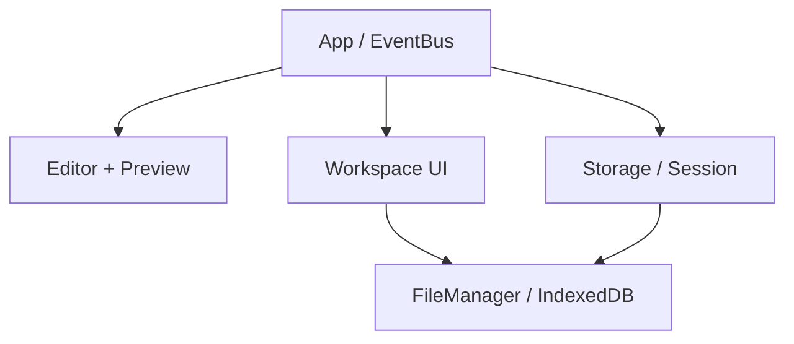

# RealtimeMarkdownEditor 統合調査

> 調査日: 2026-08-31
> 対象: `nozomiidev/RealtimeMarkdownEditor` の `main` / `37ab5c31e0b3f1ea271cb495792b18c2999c794d`
> 結論の強さ: **実装ソースを直接確認した事実**と、そこから導いた**提案**を分けて記す。

## 結論

`RealtimeMarkdownEditor` は、Codex Cockpit の**画面骨格、テーマ、ファイルツリー、Markdownプレビュー、ブラウザ内ワークスペースの出発点**として再利用価値が高い。一方、公式 Codex と本物の Bash / Node / npm を動かすランタイム基盤としては使えない。最も費用対効果が高い進め方は、同リポジトリをそのまま巨大なプラグインで増築することではなく、次の三つを先に抽出して CodexCockpit 側へ移植することである。

1. UIシェル: テーマ変数、ペイン、サイドバー、モバイル対応、ステータスバー
2. `WorkspaceStore` 境界: 現行の IndexedDB 実装と、ホスト上の実ファイルシステム実装を交換可能にする
3. イベント境界: エディタ、ファイル、ターミナル、Codexプロトコルを疎結合にする

接続時は**ホスト側ワークスペースを唯一の正本**にする。IndexedDBとホストFSを双方書き込み可能な二重正本にしてはいけない。オフライン時だけ IndexedDB 実装へ明示的に切り替える。

また、現行の `ExtensionManager` は良い意図を持つ足場だが、Cockpit全体を載せる完成したプラグインAPIではない。宣言されているフックの多くは実際の保存・描画・ファイルオープン経路から呼ばれておらず、ツールバー配列にもDOM反映処理がない。これを拡張して全体をプラグイン化するより、まず小さな明示的インターフェースを作る方が安全である。

## 調査範囲と証拠

- 添付された事前調査 `貼り付けたマークダウン（1）(6).md` を全818行確認した。
- private repository は GitHub connector で `main` の各ファイルを取得し、最新コミットを確認した。
- 最新コミットは 2026-02-22 の [`37ab5c31`](https://github.com/nozomiidev/RealtimeMarkdownEditor/commit/37ab5c31e0b3f1ea271cb495792b18c2999c794d)。リポジトリの [`LICENSE`](https://github.com/nozomiidev/RealtimeMarkdownEditor/blob/37ab5c31e0b3f1ea271cb495792b18c2999c794d/LICENSE) は Apache-2.0。
- 比較対象は、統合パターンを直接提供する StackEdit、HedgeDoc、xterm.js、Milkdown、TOAST UI Editor に限定した。
- OSSの人気や最終push日時は変動するため、本稿では採否の主根拠にせず、2026-08-31 時点の健全性シグナルとしてだけ扱う。

## 現行アーキテクチャの棚卸し

### 起動と依存関係

現行は `index.html` から `js/app.js` を `type="module"` で読み込む、ビルド工程のない静的アプリである。DOMPurify、MathJax、Mermaid、JSZip は CDN のグローバルスクリプトとして読み込む。[`index.html`](https://github.com/nozomiidev/RealtimeMarkdownEditor/blob/37ab5c31e0b3f1ea271cb495792b18c2999c794d/index.html#L610-L648)

`App.init()` の初期化順は明快である。

1. i18n
2. IndexedDB の `FileManager`
3. Editor / Preview / Workspace / Storage / ExtensionManager / FindReplace
4. DOMイベントの配線
5. セッション復元または初期ファイル作成
6. `onInit` フック

実装: [`js/app.js`](https://github.com/nozomiidev/RealtimeMarkdownEditor/blob/37ab5c31e0b3f1ea271cb495792b18c2999c794d/js/app.js#L1-L99)



この構成は小規模アプリとして理解しやすい。ただし全コンポーネントが `app.fileManager`、`app.workspace`、`app.editor` を直接参照するため、ランタイムや永続化方式の交換には適さない。

### ファイル永続化

`FileManager` は IndexedDB の `realtimemd-workspace` データベース、`files` object store を使い、`path` を主キーにする。エントリは概ね次の形である。[`js/filemanager.js`](https://github.com/nozomiidev/RealtimeMarkdownEditor/blob/37ab5c31e0b3f1ea271cb495792b18c2999c794d/js/filemanager.js#L1-L91)

```js
{
  path,
  name,
  type,
  content,
  kind,       // file | directory
  size,
  createdAt,
  updatedAt
}
```

提供済み機能は次のとおり。

| 機能 | 現行実装 | Cockpitでの扱い |
| --- | --- | --- |
| 読み書き | `saveFile`, `getFile` | インターフェース化して再利用 |
| 一覧・ツリー | `getAllFiles`, `buildFileTree` | ツリー生成はUI側セレクタへ分離 |
| 削除・rename | 子孫走査を含む | アダプタ経由へ変更 |
| 画像URL | `Blob URL` のキャッシュ | IndexedDB実装に残す |
| JSON import/export | バイナリをBase64化 | オフライン教材の入出力に再利用 |
| 変更通知 | なし。呼び出し側がイベント送信 | `watch()` を境界に追加 |
| 競合・revision | なし | ホストFS側にrevisionを導入 |
| Unix属性・symlink | なし | 最小APIでは扱わずcapability化 |

実装: [`js/filemanager.js`](https://github.com/nozomiidev/RealtimeMarkdownEditor/blob/37ab5c31e0b3f1ea271cb495792b18c2999c794d/js/filemanager.js#L94-L191)、[`画像URLとexport/import`](https://github.com/nozomiidev/RealtimeMarkdownEditor/blob/37ab5c31e0b3f1ea271cb495792b18c2999c794d/js/filemanager.js#L204-L318)

現行 `renameFile` は新パスへ保存して旧パスを削除するため、ディレクトリ配下の多数ファイルでは複数トランザクションになり、途中失敗時に原子性がない。ホストFS実装へそのアルゴリズムを持ち込まず、各バックエンドの `rename` を使うべきである。

### セッション永続化

`Storage` はファイル本文を IndexedDB、UIセッションを `localStorage['realtimemd-session']` に保存する。1秒debounceと30秒周期保存がある。[`js/storage.js`](https://github.com/nozomiidev/RealtimeMarkdownEditor/blob/37ab5c31e0b3f1ea271cb495792b18c2999c794d/js/storage.js#L1-L122)

セッションには本文のコピー、active path、サイドバー、テーマ、展開ディレクトリが入る。このため本文は IndexedDB と localStorage に重複する。Cockpitでは次のように分ける。

- `WorkspaceStore`: ファイル内容の正本
- `WorkbenchStateStore`: 開いているタブ、選択パス、ペインサイズ、表示モード
- `GameSessionStore`: プレイヤー、ターン、採点、プロトコルイベントの参照ID
- Codexのスレッド履歴: Codex/app-server側の正本を参照し、ブラウザへ複製しない

### エディタとプレビュー

エディタは Monaco や CodeMirror ではなく、行番号・undo/redo・検索置換を独自に足した `textarea` である。[`js/editor.js`](https://github.com/nozomiidev/RealtimeMarkdownEditor/blob/37ab5c31e0b3f1ea271cb495792b18c2999c794d/js/editor.js#L1-L72) Markdown変換も独自parserで、DOMPurifyによるsanitizeは `Preview` 側に置かれる。[`js/markdown.js`](https://github.com/nozomiidev/RealtimeMarkdownEditor/blob/37ab5c31e0b3f1ea271cb495792b18c2999c794d/js/markdown.js#L1-L94)、[`js/preview.js`](https://github.com/nozomiidev/RealtimeMarkdownEditor/blob/37ab5c31e0b3f1ea271cb495792b18c2999c794d/js/preview.js#L1-L97)

教材文書とJSONリクエストの初期MVPには十分で、最初からエディタを総入れ替えする必要はない。LLMリクエストのJSON Schema診断、巨大ログ、複数ファイルdiffが必要になった時点で、`EditorPort` の背後を CodeMirror 6 または Monaco に交換する。

### ワークスペースUI

ファイルツリーは `FileManager.buildFileTree()` の結果をDOMへ描画し、テキストファイルをエディタへ開く。対応拡張子には `json`, `js`, `ts`, `sh`, `py`, `rs` などが既に含まれる。[`js/workspace.js`](https://github.com/nozomiidev/RealtimeMarkdownEditor/blob/37ab5c31e0b3f1ea271cb495792b18c2999c794d/js/workspace.js#L106-L145)、[`ファイルオープン`](https://github.com/nozomiidev/RealtimeMarkdownEditor/blob/37ab5c31e0b3f1ea271cb495792b18c2999c794d/js/workspace.js#L267-L299)

デスクトップでは sidebar + editor/preview のflexレイアウト、767px以下では縦積みとdrawerになる。[`index.html`](https://github.com/nozomiidev/RealtimeMarkdownEditor/blob/37ab5c31e0b3f1ea271cb495792b18c2999c794d/index.html#L380-L498)、[`css/style.css`](https://github.com/nozomiidev/RealtimeMarkdownEditor/blob/37ab5c31e0b3f1ea271cb495792b18c2999c794d/css/style.css#L334-L565)、[`mobile`](https://github.com/nozomiidev/RealtimeMarkdownEditor/blob/37ab5c31e0b3f1ea271cb495792b18c2999c794d/css/style.css#L1270-L1364)

再利用しやすいもの:

- CSSカスタムプロパティとdark/lightテーマ
- pane header、status bar、resize handleの外観
- explorerのDOM生成とcontext menu
- toast、dialog、mobile drawer
- 多言語辞書と `data-i18n-*` 適用方式

作り替えるもの:

- 固定された editor/preview 2分割を、terminal / editor / cockpit を載せられる `WorkbenchLayout` にする
- `App` の巨大なDOM配線を、feature単位のcontrollerへ分ける
- explorerが具体的な `FileManager` を参照する箇所を `WorkspaceStore` 参照へ変える

### 拡張機構の実効性

`ExtensionManager` は `beforeRender`, `afterRender`, `beforeSave`, `afterSave`, `onFileOpen`, `onEditorChange` などを宣言し、toolbar/status/sidebar用の配列を持つ。[`js/extensions.js`](https://github.com/nozomiidev/RealtimeMarkdownEditor/blob/37ab5c31e0b3f1ea271cb495792b18c2999c794d/js/extensions.js#L1-L126)

しかしソース全体を照合すると、実際に `runHook` されるのは `onInit` と `onThemeChange` だけである。[`Appの呼び出し`](https://github.com/nozomiidev/RealtimeMarkdownEditor/blob/37ab5c31e0b3f1ea271cb495792b18c2999c794d/js/app.js#L88-L94)、[`theme hook`](https://github.com/nozomiidev/RealtimeMarkdownEditor/blob/37ab5c31e0b3f1ea271cb495792b18c2999c794d/js/app.js#L369-L381) `addToolbarButton` と `addStatusBarItem` は配列とイベントを更新するが、そのイベントを購読してDOMへ描画するコードは確認できない。[`js/extensions.js`](https://github.com/nozomiidev/RealtimeMarkdownEditor/blob/37ab5c31e0b3f1ea271cb495792b18c2999c794d/js/extensions.js#L128-L176)

したがって「拡張スロットがあるので、Terminal/Cockpitを既存プラグインだけで実装できる」は誤りである。拡張機構は将来用の足場として保持してよいが、ランタイム、ワークスペース、ゲーム状態は正式なコア境界にする。

## 静的ホスティング制約

### 静的配信とビルド無しは別の要件

CodexCockpitの成果物は静的ホスティングできる。しかし、高品質な依存管理のために**開発時ビルドまで禁止する必要はない**。現行は CDN global に依存するため、バージョン再現性、SRI/CSP、オフライン教材、サプライチェーン監査が弱い。xterm.js自身もnpmとES moduleによる導入を推奨している。[xterm.js README](https://github.com/xtermjs/xterm.js/blob/master/README.md#L14-L31)

提案:

- Vite等の薄いビルドを導入し、productionはハッシュ付き静的assetにする
- CDN globalを固定npm依存へ移す
- `index.html` の静的配信可能性は維持する
- app-server/gatewayのURLだけ実行時設定として注入する

### ブラウザ内FSとホストFSは別物

現行の IndexedDB ファイルは、ホスト上で動く Bash / npm / Codex から見えない。Terminalで `echo x > a.txt` した結果をeditorへ反映し、editorの保存をCodexから読ませるには、接続モードでホストFSを正本にして変更通知を購読する必要がある。

悪い構成:

```text
Editor -> IndexedDB
Terminal/Codex -> host filesystem
```

推奨構成:

```text
Editor / Explorer / Terminal / Codex
                |
          HostWorkspaceStore
                |
      isolated host workspace
```

IndexedDBはオフライン教材、未接続のデモ、またはread-through cacheに限定する。同期を後付けするなら、少なくとも `revision`, `etag`, `origin`, `conflict` をイベントに持たせる。

### 公式Codexは静的ページ内で直接実行できない

事前調査の中心結論は確認できた。公式 npm launcher はOS/CPU別のCodex executableを選び、`node:child_process.spawn` で起動する。[公式launcher](https://github.com/openai/codex/blob/main/codex-cli/bin/codex.js) 公式TypeScript SDKも CLI をspawnしてJSONLで通信し、Node.js 18+を要求する。[公式SDK README](https://github.com/openai/codex/blob/main/sdk/typescript/README.md#codex-sdk)、[SDKのspawn実装](https://github.com/openai/codex/blob/main/sdk/typescript/src/exec.ts)

よって、公式Codexを採用する本番モードは次のいずれかになる。

- ローカルcompanion/gateway上で Codex/app-server と isolated workspace を動かす
- サーバ側の一時コンテナで同じものを動かす
- ブラウザは xterm.js とプロトコルUIだけを担当する

xterm.jsは端末frontendであってBashではなく、通常はPTYへ接続するという事前調査も一次情報で確認できる。[xterm.js README](https://github.com/xtermjs/xterm.js/blob/master/README.md#what-xtermjs-is-not)

### Resetの危険性

現行 `GigaReset` は origin上のlocalStorage、sessionStorage、全IndexedDB、Cache Storage、Service Worker登録、cookieをbest-effortで一括削除する。[`js/app.js`](https://github.com/nozomiidev/RealtimeMarkdownEditor/blob/37ab5c31e0b3f1ea271cb495792b18c2999c794d/js/app.js#L703-L752)

Cockpitで同じoriginに認証、教材cache、game replay、複数ワークスペースを置くと範囲が広すぎる。`Reset current game`、`Clear offline workspace`、`Disconnect runtime` を別操作にし、DB名とcache keyをsession namespaceで限定する。ホスト側削除はブラウザresetに連動させず、別の確認とランタイム側認可を必須にする。

## 提案するアダプタ境界

### 1. WorkspaceStore

現行 `FileManager` を次の最小インターフェースの背後へ移す。Nodeの `fs` 全体をブラウザ側に再定義しないことが重要である。

```ts
type WorkspacePath = `/${string}`;

type WorkspaceEntry = {
  path: WorkspacePath;
  kind: 'file' | 'directory';
  size?: number;
  mime?: string;
  revision?: string;
  updatedAt?: number;
};

interface WorkspaceStore {
  readonly id: string;
  readonly capabilities: ReadonlySet<
    'binary' | 'atomicRename' | 'watch' | 'chmod' | 'symlink'
  >;

  ready(): Promise<void>;
  list(path: WorkspacePath): Promise<WorkspaceEntry[]>;
  stat(path: WorkspacePath): Promise<WorkspaceEntry | null>;
  read(path: WorkspacePath): Promise<Uint8Array>;
  write(
    path: WorkspacePath,
    data: Uint8Array,
    options?: { expectedRevision?: string; create?: boolean }
  ): Promise<WorkspaceEntry>;
  mkdir(path: WorkspacePath): Promise<void>;
  rename(from: WorkspacePath, to: WorkspacePath): Promise<void>;
  remove(path: WorkspacePath, options?: { recursive?: boolean }): Promise<void>;
  watch?(listener: (event: WorkspaceEvent) => void): () => void;
  objectUrl?(path: WorkspacePath): Promise<string | null>;
}
```

実装は二つから始める。

- `IndexedDbWorkspaceStore`: 現行 `FileManager` を包み、オフライン/教材モードで使う
- `HostWorkspaceStore`: gateway経由でisolated host directoryを操作し、watchイベントを受け取る

`buildFileTree()` はstoreから外し、`list()` の結果を `ExplorerModel` が木へ変換する。`Blob URL` はブラウザ実装だけのoptional capabilityにする。

### 2. TerminalSession

UIとランタイムを分ける。

```ts
interface TerminalSession {
  readonly sessionId: string;
  start(input: {
    cwd: WorkspacePath;
    command?: string[];
    cols: number;
    rows: number;
  }): Promise<void>;
  write(data: string): Promise<void>;
  resize(cols: number, rows: number): Promise<void>;
  signal(signal: 'SIGINT' | 'SIGTERM' | 'SIGHUP'): Promise<void>;
  onData(listener: (data: string) => void): () => void;
  onExit(listener: (exit: { code?: number; signal?: string }) => void): () => void;
}
```

`XtermTerminalView` はこのinterfaceだけを見る。将来 `HostPtyTerminalSession` と `BrowserShellTerminalSession` を交換できるが、公式Codexモードの既定は前者にする。

### 3. CockpitSession

Codexプロトコルの教材画面をterminal transportへ混ぜない。

```ts
interface CockpitSession {
  connect(): Promise<void>;
  onEnvelope(listener: (event: ProtocolEnvelope) => void): () => void;
  onState(listener: (state: GameState) => void): () => void;
  submitModelResponse(response: PlayerModelResponse): Promise<void>;
  submitApproval(decision: ApprovalDecision): Promise<void>;
  pause(): Promise<void>;
  resume(): Promise<void>;
}
```

生のtransport frame、正規化したCodex event、ゲーム用challengeを別型にする。これにより「実際に届いたJSON」と「初心者向け表示」を同じイベントから生成できる。

### 4. EditorPort

現行textareaを保ったまま交換可能にする。

```ts
interface EditorPort {
  open(document: { path: WorkspacePath; text: string; revision?: string }): void;
  getText(): string;
  setDiagnostics(items: Diagnostic[]): void;
  onChange(listener: (text: string) => void): () => void;
  onSave(listener: () => void): () => void;
}
```

最初は `TextareaEditorPort`、必要になった時だけ `CodeMirrorEditorPort` / `MonacoEditorPort` を足す。

## UIへの具体的な統合案

現行のファイルexplorer、ペインheader、テーマは残し、固定2分割を次のworkbenchへ置き換える。

| 領域 | 内容 | 現行からの再利用 |
| --- | --- | --- |
| Activity bar / Explorer | files, lessons, sessions | ribbon、sidebar、file tree |
| 左メイン | Terminal / Editor / Diff のtabs | pane header、resize CSS、textarea editor |
| 右メイン | Raw request / Guided form / Raw response | preview pane、Markdown renderer、dialog |
| 下部 | transport状態、cwd、player、turn、tokens | statusbar |
| mobile | TerminalとCockpitをtab切替 | drawerとmobile action barの考え方 |

製品の2プレイヤーモードは、左と右を**別のrole-specific route / browser window**として実装する。同一タブのsplit viewは開発用と一人用に残すが、2プレイヤー通信の正本にはしない。各windowは同じcompanion sessionへ独立に接続し、serverが付番するevent streamから自分のread modelを作る。`BroadcastChannel` は同一端末上のwindow検出やfocus要求には使えても、game state、presence、回答claimの正本にはしない。詳細は後述の「Second-pass cross-check」で固定する。

## 類似OSSから借りるもの

### StackEdit: store / service / persistence の分離

[StackEdit](https://github.com/benweet/stackedit) は Apache-2.0 のブラウザMarkdown editorで、`src/store`、`src/services/workspaceSvc.js`、`src/services/localDbSvc.js` を分けている。[services directory](https://github.com/benweet/stackedit/tree/master/src/services)、[store directory](https://github.com/benweet/stackedit/tree/master/src/store) 特にlocal DBと表示状態の間にstoreを置き、IndexedDBの変更をstoreへ適用する構成は、本件のアダプタ分離のよい先例である。[localDbSvc](https://github.com/benweet/stackedit/blob/master/src/services/localDbSvc.js)

ただし最終pushは2023-07-04で、現代的なCockpit基盤としてforkする候補ではない。コードを大量に移植せず、**状態と永続化を分ける設計パターンだけ借りる**。

### HedgeDoc: frontend / backend 分離の先例

[HedgeDoc](https://github.com/hedgedoc/hedgedoc) のdevelop branchは2.0 alphaで、READMEがfrontendとbackendの二部構成を明記している。[README](https://github.com/hedgedoc/hedgedoc/blob/develop/README.md#state-of-the-project) これは「静的に配信できるUI」と「協調編集・認証・永続化を担うruntime」を分ける妥当性を補強する。

一方でAGPL-3.0、Yjs/CodeMirrorを含む大規模monorepoで、CodexCockpitへ直接コピーするには過剰である。協調編集が必要になった時のプロトコル設計資料としてのみ参照し、コード依存は避ける。

### xterm.js: 直接採用候補

[xterm.js](https://github.com/xtermjs/xterm.js) は MIT、2026-08-30にも更新があり、terminal frontendとして直接採用価値が高い。公式READMEは、IME/CJK、curses、GPU renderer、addon群に加え、「BashではなくPTY等へ接続するfrontend」であることを明記する。[README](https://github.com/xtermjs/xterm.js/blob/master/README.md)

現行 `RealtimeMarkdownEditor` へ持ち込む時は、CDN globalではなくビルド済み静的assetとして `@xterm/xterm` と必要最小限のaddonを固定する。

### Milkdown / TOAST UI Editor: 今は採用しない

- [Milkdown](https://github.com/Milkdown/milkdown): MIT、plugin-drivenで活発。ProseMirror系のWYSIWYG編集が主目的で、JSONプロトコル編集・terminal中心のCockpitでは移行コストが便益を上回る。
- [TOAST UI Editor](https://github.com/nhn/tui.editor): MIT、完成度の高いMarkdown/WYSIWYG部品。ただし2024-08-01以降pushがなく、現行textareaからの早期置換は本件の主要リスクを減らさない。

両者から「editorを独立部品として扱う」考え方は借りるが、最初の統合では `EditorPort` の現行実装を維持する。

## 事前調査の検証結果

| 事前調査の主張 | 判定 | 根拠・修正 |
| --- | --- | --- |
| xterm.jsはterminal frontendで、Bashではない | **確認** | [xterm.js公式README](https://github.com/xtermjs/xterm.js/blob/master/README.md#what-xtermjs-is-not) |
| 公式Codex npm packageはnative executableを起動する | **確認** | [公式launcher](https://github.com/openai/codex/blob/main/codex-cli/bin/codex.js) |
| 公式TypeScript SDKもCLIをspawnする | **確認** | [SDK README](https://github.com/openai/codex/blob/main/sdk/typescript/README.md)、[実装](https://github.com/openai/codex/blob/main/sdk/typescript/src/exec.ts) |
| 静的・非WASMブラウザ内で公式Codexをそのまま実行できる | **不可能という結論を確認** | native executableと`child_process`が必要。remote/native companionが必要 |
| MoonBashをshell coreにするのが最善 | **要件変更で優先度低下** | 公式Codexを動かす現要件では、本物のhost PTYを既定にする。MoonBashはoffline tutorial候補に降格 |
| just-bash coreはbrowser対応 | **確認** | [公式README](https://github.com/vercel-labs/just-bash/blob/main/packages/just-bash/README.md#browser-support)。ただしbetaで、Node依存機能はbrowser非対応 |
| npm-in-browserで`npm install`を行える | **確認、ただし主経路にはしない** | [公式README](https://github.com/naruaway/npm-in-browser/blob/main/README.md)。メモリリークや分離不足の既知制約があり、最終pushは2023-10-08 |
| LightningFSはIndexedDB永続FSとして使える | **確認** | [公式README](https://github.com/isomorphic-git/lightning-fs/blob/main/README.md)。Node `fs` 全体ではなくisomorphic-git向けsubset |
| BrowserFSを中心に置く | **再評価が必要** | 現行RealtimeMDには既に小さなIndexedDB実装がある。host接続が主なら全面置換の効果が薄い。採るとしてもZenFS等と別トラックで比較 |
| IndexedDBとOPFSをmetadata/blobに分ける | **未検証の設計案** | この分割を支持する実測値は添付調査にない。大量ファイルのbenchmark後に決める |
| Web Workerをprocess、MessageChannelをpipeとしてOSを再構成する | **可能性の提案だが現要件では車輪の再発明** | official Codex/real bashが必要ならhost runtimeを再利用する |
| Monacoへ置換すべき | **時期尚早** | 現行textareaを`EditorPort`で包み、JSON Schema/diff要件が固まってから選ぶ |
| MCP HTTP clientをブラウザから使える | **本稿では未検証** | MCP/transport調査へ委譲 |
| WebRTCをremote terminalに使う | **本稿では未検証・非MVP** | まずWebSocket/companionで一人用を成立させる |

## 移行計画

### Phase 0: ベースライン固定

- `37ab5c31` を統合元として記録する
- Apache-2.0のLICENSEを保持し、移植・変更ファイルの出所を記録する。NOTICEが存在する場合はそれも保持する
- RealtimeMarkdownEditorのprivate Git履歴は公開先へ取り込まず、選択した現行ファイルだけを由来表付きの単一import commitで移植する
- inherited analytics ID、canonical URL、製品名、reset処理を移植対象から外す
- 現行の起動、編集、保存、import/export、mobile表示をsmoke test化する

### Phase 1: 境界抽出（見た目と動作を変えない）

- `FileManager` を `IndexedDbWorkspaceStore` として包む
- `Workspace` と `Storage` の直接参照を `WorkspaceStore` へ置換する
- `Editor` を `TextareaEditorPort` で包む
- `App` 内のEventBusを独立moduleへ出し、イベント名とpayloadを文書化する
- 既存の未接続extension hooksを「接続する」「削除する」「将来用」の三群に整理する

完了条件: 現行UIが同じIndexedDBデータを開き、既存exportを読み戻せる。

### Phase 2: 静的workbench化

- npm/Viteによるreproducible buildを追加する
- 固定2ペインを `WorkbenchLayout` にする
- `terminal-player`、`model-player`、`solo`、`dev/dual` のstatic entry routeを同じcomponent群から生成する
- terminal viewへxterm.jsを追加する
- `FakeTerminalSession` で入力、resize、stream、exitのUIを先に検証する

完了条件: GitHub Pages相当の静的配信でroleごとのwindowと開発用dual viewが動き、fake sessionでも直接store共有ではなく共通session client経由で同期する。まだ本物のshellは不要。

### Phase 3: companion接続

- `HostWorkspaceStore` と `HostPtyTerminalSession` を実装する
- sessionごとのisolated directoryを払い出す
- file watcherをexplorer/editorへ反映する
- 接続時はhostを正本にし、IndexedDBへの書き込みを止める

完了条件: terminalで作ったファイルがeditorへ現れ、editor保存をshell/Codexが同じパスから読める。

### Phase 4: 公式Codex + Cockpit

- Codex/app-server transportを `CockpitSession` へ接続する
- raw envelope、正規化イベント、guided formを同一event logから派生させる
- response validation、approval、timeout、pause/resumeを実装する
- 一人用auto-responseと二人用human-responseを同じstate machineのpolicy差として実装する

完了条件: 左の公式Codexから発生した一つのturnを、右プレイヤーが観察・応答し、結果が同じsessionに戻る。

### Phase 5: 安全性と回復

- current-sessionだけを消すresetへ変更する
- host process/workspaceのresource limitと終了処理を加える
- refresh後のterminal再接続、event replay、途中turn復帰を試験する
- binary file、rename競合、外部変更、接続断、二重送信をE2E試験する

## 最小の再利用・変更マップ

| 現行ファイル | 方針 | 最初の変更 |
| --- | --- | --- |
| `index.html` | 構造を部分再利用 | ペイン領域をWorkbench mount pointへ |
| `css/style.css` | 大幅再利用 | theme tokenを分離、3ペイン/dockに拡張 |
| `js/app.js` | 分割 | bootとfeature controllerへ分離 |
| `js/filemanager.js` | adapter実装として再利用 | `IndexedDbWorkspaceStore`で包む |
| `js/storage.js` | UI state部分を再利用 | file content重複を廃止 |
| `js/workspace.js` | explorer UIを再利用 | `WorkspaceStore`依存へ変更 |
| `js/editor.js` | MVPで再利用 | `TextareaEditorPort`で包む |
| `js/preview.js` / `markdown.js` | 教材・説明paneで再利用 | untrusted content境界を維持 |
| `js/extensions.js` | 小さく再設計 | 未接続APIを棚卸し、core境界には使わない |
| `js/i18n.js` | 再利用 | 新featureのnamespaceを追加 |

## Second-pass cross-check

[`04-web-ide-workbench.md`](./04-web-ide-workbench.md) と [`08-reference-architecture.md`](./08-reference-architecture.md) を相互参照し、初稿で未決だった二点を次のとおり確定する。

### 決定1: RealtimeMarkdownEditorは「由来を記録した一回限りの選択コピー」で取り込む

**subtree、package化、元リポジトリでの継続ではなく、`37ab5c31` の必要ファイルだけをCodexCockpitへ一度コピーして分解する。** RealtimeMarkdownEditorは以後read-onlyの原典として参照し、自動のupstream/downstream同期は設けない。

| 選択肢 | 判定 | 理由 |
| --- | --- | --- |
| 選択コピー + provenance | **採用** | UI資産だけを使え、Cockpit固有構造へすぐ分解できる。不要なanalytics/reset/SEOを持ち込まない |
| `git subtree` | 不採用 | private repoの過去履歴をpublic repoへ露出する危険がある。`--squash`でも未使用のアプリ全体を二重管理する |
| npm/package化 | 不採用 | 現行moduleはDOM IDと`App` objectへ密結合しており、安定したpackage APIを先に設計する費用が便益を超える |
| RealtimeMarkdownEditor側で開発継続 | 不採用 | Markdown editorとCockpit runtime/gameのrelease、権限、issue、製品境界が混ざる |

具体的なimport規約:

1. `37ab5c31e0b3f1ea271cb495792b18c2999c794d` を入力commitとして固定し、最初のportを一つの専用commitにする。
2. `licenses/RealtimeMarkdownEditor-Apache-2.0.txt` に元LICENSEを保持する。
3. `docs/provenance/realtime-markdown-editor.md` に元repo/commit、コピーしたファイル、移植先、変更概要を表で記録する。
4. 直接派生したJS/CSS/HTMLには、Apache-2.0のSPDX識別子、元commit、CodexCockpitで変更済みである旨をheaderへ入れる。
5. `index.html` のGoogle Analytics ID、元製品のSEO/canonical、`GigaReset` はコピーしない。秘密でなくても、別製品の運用設定と破壊的挙動を継承しない。
6. 将来元repoの修正を取り込む場合は自動mergeせず、元commitと対象diffをprovenanceへ追記して手動portする。

推奨する初回対応は、ファイルを旧構造のまま `vendor/` に永久保存することではない。theme token、explorer view、IndexedDB adapter、textarea editor、Markdown lesson rendererとして実際のfeature directoryへ移し、由来表で一対一に追跡する。これなら重複実装を抱えず、original commitへの監査可能性も失わない。

### 決定2: 2プレイヤーは二つのrole-specific route、同一タブはdev/solo

本番2プレイヤーは次の論理routeを持つ。rewriteを提供するhostではこのURLをそのまま配る。GitHub Pagesのようなrewriteなしstatic hostでは `/terminal/`、`/model/`、`/solo/`、`/dev/dual/` を実ファイルentryとし、非secretのsession IDをhash routeへ置くか、redeem済み招待から取得する。どちらの場合もrole/sessionの意味論は同じにする。

```text
/sessions/{sessionId}/terminal  -> terminal-player window
/sessions/{sessionId}/model     -> model-player window
/sessions/{sessionId}/solo      -> one-player composition
/sessions/{sessionId}/dev/dual  -> development-only dual view
```

routeは表示意図であり、権限そのものではない。companionが認証後に短命のsession capabilityとrole claimを発行し、URLには長寿命tokenを置かない。

| route / role | 書き込み可能な主操作 | 読み取りprojection |
| --- | --- | --- |
| `terminal-player` | terminal input/resize、workspace command、Codex turn開始 | terminal、workspace、公開済みgame progress |
| `model-player` | inference claim/commit、response draft、hint要求 | raw/structured request、tool contract、許可されたterminal context |
| `solo` | 選択したone-player policyが両roleを調停 | 左右の統合projection |
| `dev/dual` | test sessionに限り両roleを操作 | protocol traceを含む開発projection |

各windowはcompanionの同じauthoritative sessionへ独立に接続する。companionのappend-only logが単調増加`seq`を付け、再接続時はlast seen `seq`から追いつく。model responseはclaim/leaseとexpected versionで一意にcommitし、terminal input等のcommandにはclient-generated idempotency keyを付ける。片方のwindowのJavaScript storeをもう片方が直接参照してはいけない。

`dev/dual` は二つのrole componentを一つのdocumentへmountしてもよいが、それぞれ独立したsession clientを使い、必ずcompanionを往復する。これにより同一タブで成功しただけの機能が、別browser profile、別端末、ネットワーク切断で壊れるのを防ぐ。`solo` は開発用shortcutではなく、`HumanModelPlayer` / `ScriptedModelPlayer` / `UpstreamModelPlayer` を選べる正式な一人用policyである。

`BroadcastChannel` と `window.open()` は補助に限定する。

- `window.open()` は招待済みmodel routeを別windowで開くconvenience。
- `BroadcastChannel` は同一originでの重複window警告、既存windowへのfocus要求、local theme hint。
- presence、role、terminal input、request claim、response commit、score、replay cursorはすべてserver eventが正本。
- Dockview popoutは一人の同一role内でpanelを整理するUI機能であり、player/session分離には使わない。

### 既存調査との整合

- 04の `CSS Grid + Split.js` はroleごとのwindow内部レイアウトに使う。別player windowを作る理由でDockviewへ昇格しない。
- 08のcompanion append-only event log、role claim、claim/leaseをwindow間同期の正本にする。
- 本稿の `WorkbenchLayout` はroute間で共通componentを再利用するが、routeごとのbundle/権限projectionは分ける。
- 本稿の `CockpitSession` は同一タブ専用busではなく、companion session clientのportとする。

## 追加で決めるべき問い

1. companionはユーザー端末のlocal daemonか、サーバ側ephemeral containerか。両対応ならsession APIを先に固定するか。
2. host workspaceのファイルwatch eventにrevisionをどう付与するか。
3. editorの保存中にCodexが同じファイルを変更した場合、reload / diff / conflictのどれを表示するか。
4. raw protocol eventをどこまで永続化し、secret・画像・tool outputをどうredactするか。
5. `ExtensionManager` を外部plugin APIとして維持するか、内部feature registryへ縮小するか。

## 採否

**採用:** RealtimeMarkdownEditorのUI資産、ファイルexplorer、Markdown教材表示、i18n、IndexedDBオフライン実装。
**条件付き採用:** 現行textarea editor、extension manager、browser shell候補。
**採用しない:** IndexedDBを公式Codexとterminalの正本にする構成、ブラウザ内でOS/Node/Codexを再実装する構成、全originを消すGigaReset。
**新設:** WorkspaceStore / TerminalSession / CockpitSession / EditorPort と、薄いcompanion gateway。

この分け方なら、既存の完成部分を捨てず、同時に「公式Codexを動かす」という現在の要件のためにブラウザOSを作り直す必要もない。
