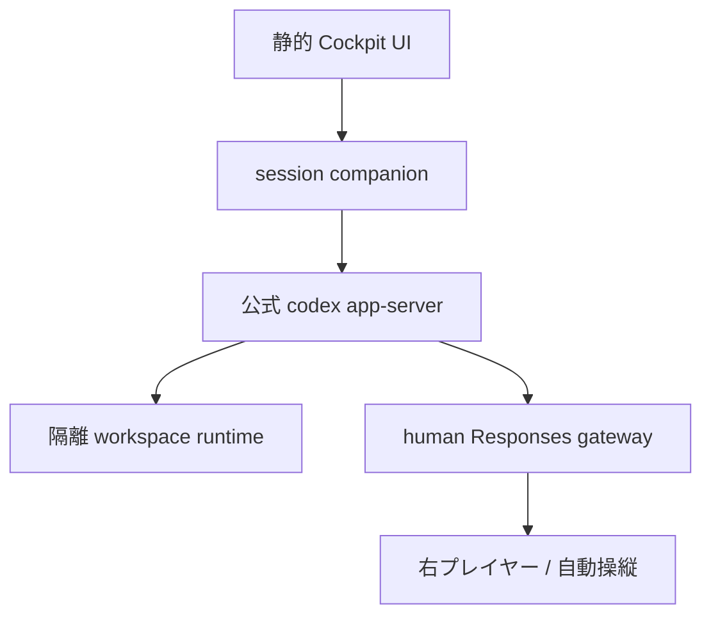

# CodexCockpit 参照アーキテクチャ（調査版）

更新日: 2026-08-31

## 結論

最有力構成は、静的 Web UI にすべてをエミュレートさせる方式ではない。**静的 UI + セッション専用 companion + 隔離 runtime + 公式 Codex app-server + Responses-compatible human gateway** とする。

これにより、左プレイヤーは xterm.js 上の本物の shell で公式 Codex TUI を使い、右プレイヤーは Codex がモデルへ送った実際の Responses API request を読み、assistant message または tool call を返せる。Codex の thread、turn、approval、tool execution、履歴は公式 harness に残し、ゲーム固有部分だけを追加する。

## 全体像



companion は汎用バックエンドではなく、ブラウザから直接扱えない境界をまとめる薄いプロセスである。

- app-server の stdio または Unix socket を browser WebSocket へ中継する。
- app-server と session 固有 `CODEX_HOME` を起動・停止する。
- workspace と shell の隔離境界を所有する。
- human gateway の保留 request とプレイヤー接続を調停する。
- 教材用の append-only event log を採取する。
- Origin、session token、rate limit、再接続を強制する。

## 左プレイヤー: 本物の terminal と公式 TUI

### 推奨経路

1. companion が session 専用の `codex app-server` を Unix socket listener で起動する。
2. companion 自身が一つの client connection を持ち、限定された app-server API を browser 向け adapter として公開する。
3. app-server の PTY API で隔離 runtime 内の login shell を起動し、xterm.js が byte stream、stdin、resize を中継する。
4. shell 内の `codex` wrapper は、別 connection で同じ app-server へ `codex --remote unix://PATH` として接続する。
5. 左プレイヤーには公式 Codex TUI がそのまま表示される。v1 では TUI connection を thread/turn/approval の owner とし、companion connection は terminal/filesystem と read-only projection に限定する。

この multi-client 構成は公式に個々の接続方式が提供されているため概念上成立するが、同じ app-server へ接続しただけでは同じ thread を自動購読しない。subscription は connection ごとで、`thread/read` も subscription を作らない。active turn の二重 resume や approval の二重 routing を避け、同一 thread の live mirror は contract test が通るまで実装しない。右席が必要とする model wire は human gateway 自身が正本として受信する。さらに、sandbox 内 shell から socket path へ接続する permission と connection close 時の lifecycle を検証する。Linux を最初の target にして縦切りする。失敗時の順序付き fallback は `command/exec → 隔離済み process/* → node-pty → standalone codex（app-server event 共有なし）` とする。

app-server は現在、sandbox 付き `command/exec` と、明示的だが experimental・unsandboxed な `process/*` の両方で PTY streaming、stdin、resize、terminate を提供する。PoC では両方を `TerminalBackend` adapter の背後に置いて検証する。

| backend | 長所 | 短所 | 調査時点の扱い |
|---|---|---|---|
| app-server `command/exec` | 公式、sandbox policy、PTY/streaming | 長時間 login shell の実地検証が必要 | 第一 spike |
| app-server `process/*` | `bash -i` が公式例、PTY 制御が明瞭 | experimental、Codex sandbox 外 | 隔離コンテナ内だけで条件付き採用 |
| node-pty | 実績が多く app-server 変更から独立 | native addon と別 process manager が増える | fallback |
| pure-JS shell | 完全静的・offline | 公式 Codex/native Node を動かせない | demo/教材限定 |

### app-server を迂回しない理由

- `codex --remote` は公式 TUI と app-server を接続する既存経路である。
- app-server が認証、thread/turn/item、approval、stream、filesystem、履歴をすでに抽象化する。
- `generate-ts` / `generate-json-schema` でインストール済み Codex と一致する型を生成できる。
- Codex の内部 SQLite や JSONL を直接読むより、protocol の方が更新に追随しやすい。

## 右プレイヤー: 人間が Responses API を返す

### wire 上で実際に届くもの

Codex custom model provider の `base_url` を session 内 human gateway の `/v1` に向け、`wire_api = "responses"` を使う。右画面へ届く正本は `POST /v1/responses` の構造化 JSON であり、Jinja で連結済みの単一 prompt 文字列ではない。

gateway は受信した HTTP request を保留し、次をイベントログへ書く。

- headers の allowlist と redaction 済み metadata
- model、instructions、input items、tools、tool choice、reasoning/text 設定
- request ID、Codex thread/turn との相関 ID
- 到着時刻、回答者、回答開始・確定時刻
- raw payload の schema version と SHA-256

右プレイヤーは request を、次の複数レンズで見る。

| レンズ | 目的 | 正確性ラベル |
|---|---|---|
| Raw JSON | Codex が gateway へ送った内容 | 実データ |
| Structured | system/instructions、items、tools を理解しやすく分解 | 実データの表示変換 |
| Tool contract | 選択可能な tool と JSON Schema、call history | 実データの表示変換 |
| Jinja prompt | 選択した open-weight model の chat template を適用 | モデル依存の教材表示 |
| Token lens | tokenizer を指定した token/長さ表示 | 指定 tokenizer に限り再現 |

OpenAI の内部推論サーバで使われる非公開 prompt/tokenizer を「生の KKM」として再現できるとは主張しない。Jinja 表示は Hugging Face / vLLM 系 model の template を選んだ場合だけ正確で、OpenAI model については教材上の近似表示に留める。

### 右プレイヤーが返せる最小操作

1. assistant text を返す。
2. Codex が提示した tool を一つ選び、schema に沿った arguments を返す。
3. 複数 tool call を順序付きまたは parallel として返す。
4. reasoning summary など、選択モデルが許す追加 item を返す。
5. request を保留、破棄、再試行する。
6. 教材ヒントまたは schema validator に修正を依頼する。

gateway は手書きの JSON をそのまま送信せず、response builder の domain object を公式 Responses streaming event 列へ serialize する。イベント順序と必須 field は capture/replay fixture で固定する。

### 公式 proxy の利用

`openai/codex` の `codex-responses-api-proxy` は、`/v1/responses` だけを許可し、upstream への転送、秘密情報の扱い、request/response dump を実装済みである。人間の回答待ちキューそのものは持たないため、そのまま本体にはできないが、次に再利用価値がある。

- 実際の Codex request と upstream response を収集する golden fixture recorder。
- route/header/redaction/process-hardening の参考実装。
- one-player pass-through mode の前段 recorder。

独自 gateway の全責務を LiteLLM や推論 server に委ねる必要はない。provider 変換、課金、ロードバランス、GPU inference はこのゲームの本質ではなく、依存重量と protocol 変換誤差を増やす。

## session 固有設定

project の `.codex/config.toml` に provider 設定を置かない。現在の Codex は machine-local provider、auth、telemetry などを project-local config からは受け付けないため、companion が session 専用 `CODEX_HOME` に生成する。

概念例:

```toml
model = "gpt-5.5"
model_provider = "cockpit"

[model_providers.cockpit]
name = "CodexCockpit Human Player"
base_url = "http://127.0.0.1:PORT/v1"
wire_api = "responses"
env_key = "CODEX_COCKPIT_SESSION_TOKEN"
supports_websockets = false
request_max_retries = 0
stream_max_retries = 0
stream_idle_timeout_ms = 1800000
```

`model` は gateway の製品名ではなく、pinned Codex release が能力情報を持つ model slug を使う。任意の `cockpit-human` slug にすると context window、tool、reasoning、apply-patch 等の metadata が fallback し、学びたい harness 自体が変わり得る。調査 snapshot では通常 Responses と freeform apply-patch を持つ `gpt-5.5` を level 1、Responses Lite / code-mode-only の `gpt-5.6-terra` を level 2 とする。起動時に `model/list` と `modelProvider/capabilities/read` を preflight し、catalog fallback または lesson 必須 capability 不足なら fail closed にする。`supports_websockets = false` は model metadata が WebSocket を好む場合でも、教材の実通信を HTTP `/v1/responses` + SSE に固定する。session token を要求しない manual gateway なら `env_key` は省略でき、公式 proxy を前段に置く場合は短命 token を渡す。実際の field と version 互換性は、起動中の Codex が生成する schema および config reference で検証する。待ち時間が長い人間操作に合わせ、gateway は早期に HTTP response headers を返して heartbeat/comment を送る方式と、Codex の idle timeout 設定の両方を spike する。

## Companion の MVP 技術選択

最初の companion は Node.js / TypeScript + Fastify 5.x とする。raw WebSocket が必要な transport は `@fastify/websocket`、game command/presence/room は Socket.IO を同じ HTTP server に接続する。app-server が生成する TypeScript schema、browser の domain type、game event を共有でき、Codex/app-server と公式 proxy の child-process lifecycle を扱いやすい。Responses SSE だけは framework の自動 serialization に任せず、Node stream の backpressure と disconnect を扱う専用 encoder を使う。

主な module は次に限定する。

- `AppServerBridge`: generated schema に追随する限定 RPC adapter
- `TerminalBackend`: command/exec、process、node-pty の交換境界
- `HumanResponsesGateway`: pending/claim/validate/SSE
- `UpstreamProxySupervisor`: 公式 proxy child と upstream mode
- `SessionEventLedger`: SQLite command/event/snapshot
- `BrowserRoom`: Socket.IO による role/presence/低量 command/event

protocol fixture は言語非依存の testdata として保持し、将来 Rust へ移しても同じ contract test を通す。

## workspace と editor

RealtimeMarkdownEditor は別製品として維持し、`37ab5c31e0b3f1ea271cb495792b18c2999c794d` から必要な UI/Explorer/Markdown/i18n/IndexedDB ファイルを一度だけ選択コピーする。CodexCockpit 側に Apache-2.0 `LICENSE`、provenance manifest、派生ファイルの出所を残す。private repository の全履歴を public 側へ持ち込み得る subtree、DOM と `App` に密結合した package 化、元 repository をそのまま別製品へ変える案は採らない。

RealtimeMarkdownEditor の browser storage を正本にしたまま native shell と双方向同期すると、競合解決を新規実装することになる。runtime モードでは隔離 workspace filesystem を正本にし、editor は `WorkspaceAdapter` 経由で app-server filesystem API または companion の限定 API を使う。

```text
WorkspaceAdapter
  ├─ HostWorkspace: runtime filesystem + watch
  └─ BrowserWorkspace: IndexedDB/OPFS (offline demo)
```

HostWorkspace は absolute path を UI へ無制限に渡さず、session root からの論理 path に変換する。symlink、rename、atomic save、binary、大容量、watch overflow を companion 側で検査する。

## 2 人の画面、同期、リプレイ

本番の二人プレイは、一つの複雑な画面を popout するのではなく、同じ session へ接続する role-specific route とする。

- `/sessions/{id}/terminal`: 左プレイヤーの terminal / editor / approval view
- `/sessions/{id}/model`: 右プレイヤーの request inspector / response composer
- `/sessions/{id}/solo`: 一人で両役を明示的に切り替える view
- `/sessions/{id}/dev/dual`: 開発用。同じ端末内でも二つの独立 client として接続する

role grant、claim lease、event sequence は companion が正本を持つ。`window.open`、Dockview popout、BroadcastChannel は起動やフォーカスの補助には使えるが、認証・状態同期・競合解決には使わない。

terminal/game protocol は共同テキスト編集ではない。server が単調増加 `seq` を付ける append-only event log を正本にする。

最低限の envelope:

```json
{
  "schemaVersion": 1,
  "sessionId": "ses_...",
  "seq": 42,
  "eventId": "evt_...",
  "causationId": "evt_...",
  "actor": { "role": "model-player", "id": "player_2" },
  "type": "inference.response.committed",
  "occurredAt": "2026-08-31T00:00:00.000Z",
  "payload": {}
}
```

主な event family:

- `terminal.input` / `terminal.output` / `terminal.resized`
- `codex.rpc.requested` / `codex.rpc.notified`
- `inference.requested` / `inference.claimed` / `inference.response.committed`
- `approval.requested` / `approval.resolved`
- `workspace.changed`
- `player.joined` / `player.disconnected` / `player.resumed`
- `lesson.hint.requested` / `lesson.checkpoint.reached`

CRDT は共同メモや同じ editor buffer を二人が同時編集する追加機能にだけ使う。model request に二人が同時回答する競合は CRDT で merge せず、claim/lease と optimistic version で一意に解決する。

Socket.IO は game command、presence、claim、低量 event にだけ使う。terminal bytes は backpressure を持つ専用 binary WebSocket、app-server は generated schema に追随する限定 adapter、大きな raw artifact は認可済み HTTP reference に分ける。raw terminal stdin/stdout は既定で永続化せず、短い上限付き memory ring buffer だけを再接続に使う。教材 replay は明示 opt-in、入力非保存、scrub 済み出力、容量・時間・TTL 制限を条件にする。

## 1 人プレイ

同じ `ModelPlayer` interface に三つの実装を置く。

- `HumanModelPlayer`: 右画面で人が回答する。
- `ScriptedModelPlayer`: 教材 fixture と条件分岐で決定論的に回答する。
- `UpstreamModelPlayer`: 実 API へ中継し、request/response を観察可能にする。

最初の教材は Scripted を優先する。正解経路、失敗、tool call の順序、replay が再現でき、API 費用や model drift に依存しない。自由演習だけ Upstream を使う。

## 配置モード

| モード | runtime | 用途 | 安全境界 |
|---|---|---|---|
| Local companion | ユーザー PC | 個人学習、開発 | loopback、session token、専用 `CODEX_HOME` |
| Remote isolated | session ごとの container/VM | 2 人オンライン | TLS、認証、resource/network limit、ephemeral workspace |
| Static demo | browser only | UI 紹介、軽い教材 | native Codex なしと明示 |

「静的サイト」とは UI の配信形態を指し、本物の Codex と shell を安全に動かす計算資源まで静的 hosting だけで賄える、という意味にはしない。

## Security invariants

- app-server transport を public Internet へ直接 bind しない。
- browser から app-server の unsandboxed `process/*` を任意 argv で呼べる形にしない。
- remote session は共有ホストではなく、session 単位の OS/container boundary に置く。
- Docker socket、host home、SSH agent、cloud metadata endpoint を mount/expose しない。
- workspace root、command allow/deny policy、network egress、CPU/memory/PID/time を制限する。
- raw terminal output と model payload は秘密情報を含み得るため、保存前 redaction と retention を設定する。
- reconnect token と model-provider token を分離し、URL、localStorage、command line に生 token を置かない。
- replay export は既定で auth headers、environment、absolute host path を削除する。

## 最初に行う spike

### Spike A: official runtime loop

- pinned Codex CLI をインストールする。
- app-server を stdio で起動し、起動 version の TypeScript schema を生成する。
- xterm.js から sandboxed PTY shell を開く。
- `codex --remote` をその PTY で起動する。
- resize、Ctrl+C、Unicode/IME、再接続、終了処理を確認する。

### Spike B: one manual tool cycle

- custom Responses provider を session `CODEX_HOME` に設定する。
- request を raw/structured view に表示する。
- 右プレイヤーが tool call を一つ返す。
- Codex harness が tool を実行し、次の model request を送る。
- 右プレイヤーが final message を返し、turn が完了する。

### Spike C: capture and replay

- 公式 `codex-responses-api-proxy --dump-dir` で成功する一往復を記録する。
- auth/path を redaction して golden fixture 化する。
- 同じ sequence を ScriptedModelPlayer で再現する。
- version を上げた Codex に対し contract test を実行する。

### Spike D: workspace adapter

- RealtimeMarkdownEditor の既存 read/write/list/watch 呼び出しを adapter 化する。
- HostWorkspace で shell 編集と editor 編集を相互反映する。
- rename、外部変更、binary、conflict、offline 復帰を検証する。

## 現時点で実装しないもの

- Codex CLI または agent loop の再実装。
- ブラウザ内 Node.js compatibility runtime の自作。
- shell parser、terminal emulator、Git implementation の自作。
- Codex の SQLite/JSONL schema への直接依存。
- OpenAI 内部の非公開 prompt/tokenizer/KKM の再現をうたう機能。
- 全文書・全 terminal event への CRDT 導入。
- vLLM/LiteLLM/巨大 IDE 全体を、必要性を証明せず同梱すること。

## 一次資料

- [Codex App Server](https://developers.openai.com/codex/app-server)
- [Codex advanced configuration](https://developers.openai.com/codex/config-advanced)
- [openai/codex app-server source guide](https://github.com/openai/codex/blob/main/codex-rs/app-server/README.md)
- [openai/codex responses-api-proxy](https://github.com/openai/codex/blob/main/codex-rs/responses-api-proxy/README.md)
- [Hugging Face chat templates](https://huggingface.co/docs/transformers/chat_templating)
- [vLLM OpenAI-compatible server](https://docs.vllm.ai/en/latest/serving/online_serving/openai_compatible_server/)
